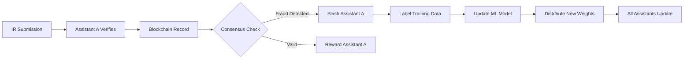

# AEQUITAS PROTOCOL: TECHNICAL SPECIFICATION v8.0

**Document Classification:** Technical Specification
**Last Updated:** 2025-11-13
**Protocol Name:** Aequitas (AURA)
**Network Type:** Sovereign Layer-1 Blockchain

---

## TABLE OF CONTENTS

1. [Core Architecture](#1-core-architecture)
2. [Consensus & Network Layer](#2-consensus--network-layer)
3. [Identity & Verification Model](#3-identity--verification-model)
4. [Inclusion Routine Registry](#4-inclusion-routine-registry)
5. [Mobile Wallet Architecture](#5-mobile-wallet-architecture)
6. [AI Assistant Network](#6-ai-assistant-network)
7. [Verification Flow Protocols](#7-verification-flow-protocols)
8. [Data Models & State](#8-data-models--state)
9. [Tokenomics Implementation](#9-tokenomics-implementation)
10. [Governance & Voting](#10-governance--voting)
11. [Security Specifications](#11-security-specifications)
12. [API & Integration](#12-api--integration)
13. [Node Operation](#13-node-operation)

---

## 1. CORE ARCHITECTURE

### 1.1 Framework

**Implementation:** Cosmos SDK v0.47+
**Language:** Go 1.21+
**Architecture Pattern:** Modular application-specific blockchain (AppChain)

### 1.2 Design Principles

- **Permissionless Protocol:** No centralized certification or approval of AI models
- **Factual Ledger:** Blockchain records immutable facts about verification events
- **Post-Hoc Validation:** Trust determined by external community analysis
- **Zero-PII On-Chain:** No personally identifiable information stored on blockchain

### 1.3 Core Modules

```
chain/
├── app/                        # Application configuration
│   ├── app.go                  # Main app setup
│   ├── module_manager.go       # Module registration
│   └── cosmos_app.go           # Cosmos SDK integration
├── x/identitychange/           # Identity change tracking module
│   ├── keeper/                 # State management
│   ├── types/                  # Proto-generated types
│   ├── msg_server.go           # Message handlers
│   └── query_server.go         # Query handlers
├── x/inclusion_routines/       # IR registry (planned)
├── x/confidence_score/         # CS aggregation (planned)
├── x/vc_registry/              # VC status registry (planned)
└── x/zkp_governance/           # ZK voting (planned)
```

### 1.4 Interoperability

**Protocol:** IBC (Inter-Blockchain Communication)
**Enabled Assets:**
- AEQ token transfers
- Verifiable Credential cross-chain validation
- State proofs for external verification

**IBC Channels:** Configurable per governance

---

## 2. CONSENSUS & NETWORK LAYER

### 2.1 Consensus Mechanism

**Type:** Tendermint Core BFT-DPoS
**Algorithm:** Byzantine Fault Tolerant Delegated Proof-of-Stake

**Parameters:**
```yaml
block_time: 2-3 seconds
finality: 1-block (instant finality)
validator_set_size: 100 (initial)
max_validators: 200 (governance adjustable)
byzantine_tolerance: 33% (< 1/3 validators can be malicious)
```

### 2.2 Validator Requirements

**Minimum Stake:** 10,000 AEQ (subject to governance)
**Hardware Requirements:**
- CPU: 4+ cores (8+ recommended)
- RAM: 16GB minimum (32GB recommended)
- Storage: 500GB SSD minimum (NVMe recommended)
- Network: 100Mbps symmetric minimum (1Gbps recommended)

**Software Requirements:**
- OS: Linux (Ubuntu 22.04+ or equivalent)
- Go: 1.21+
- Docker: 24.0+ (optional)

### 2.3 Network Topology

**Node Types:**
- Full Nodes: Complete blockchain state
- Light Clients: Header-only sync with Merkle proofs
- Archive Nodes: Full historical state (optional)
- Seed Nodes: Peer discovery
- Sentry Nodes: DDoS protection for validators

**P2P Protocol:** Tendermint P2P v0.34+
**Default Ports:**
- P2P: 26656
- RPC: 26657
- gRPC: 9090
- API: 1317

### 2.4 State Machine

**State Transition Function:**
```
S' = Apply(S, Tx)
where:
  S = Current state
  S' = New state
  Tx = Transaction
  Apply = State transition function
```

**State Commitments:**
- IAVL+ tree (Cosmos SDK default)
- Root hash included in block header
- Merkle proofs for state verification

---

## 3. IDENTITY & VERIFICATION MODEL

### 3.1 Standards Compliance

**W3C Verifiable Credentials Data Model 1.0:**
- DID Methods: `did:aura:*`
- VC Types: Extensible JSON-LD
- Proof Types: Ed25519Signature2020, JsonWebSignature2020

**W3C Decentralized Identifiers (DIDs):**
- DID Document format: JSON-LD
- Resolution protocol: DID Core Spec
- Key types: Ed25519, Secp256k1

### 3.2 Verification Model

**Type:** Binary threshold-based
**Threshold:** 10,000 ConfidenceScore (CS) points

**States:**
- `UNVERIFIED`: CS < 10,000
- `VERIFIED`: CS ≥ 10,000
- `SUSPENDED`: Manual flag by governance
- `REVOKED`: User or governance revocation

### 3.3 ConfidenceScore Calculation

```go
type ConfidenceScore struct {
    WalletAddress string
    TotalScore    uint64
    CompletedIRs  []IRCompletion
    AnchorStatus  AnchorStatus
    LastUpdated   time.Time
}

type IRCompletion struct {
    IRID          string
    Score         uint64
    CompletedAt   time.Time
    VerifierHash  []byte  // Hash of verifier plug-in
    ProofHash     []byte  // Hash of proof data
}
```

### 3.4 Mandatory Anchor (IR-000)

**Requirement:** All users must complete IR-000 before earning CS points

**Process:**
1. Government-issued ID scan (OCR)
2. Liveness detection (biometric)
3. Hologram/security feature verification
4. Face matching (ID photo to liveness)

**Score:** 0 points (prerequisite only)
**Data Retention:** None (processed client-side, destroyed immediately)

### 3.5 Asynchronous Accumulation

**Architecture:** Event-driven state updates

```go
// Pseudo-code
func CompleteIR(walletAddr string, irID string, proof Proof) error {
    // Validate anchor completion
    if !HasCompletedAnchor(walletAddr) {
        return ErrAnchorRequired
    }

    // Verify proof signature
    if !VerifyProof(proof, irID) {
        return ErrInvalidProof
    }

    // Update state atomically
    return UpdateConfidenceScore(walletAddr, irID, proof)
}
```

### 3.6 Verifiable Presentations

**Standard:** W3C Verifiable Presentations
**Proof Type:** ZK-SNARK (Groth16 or PLONK)

**Selective Disclosure:**
```json
{
  "@context": ["https://www.w3.org/2018/credentials/v1"],
  "type": "VerifiablePresentation",
  "verifiableCredential": [
    {
      "id": "urn:uuid:...",
      "type": ["VerifiableCredential", "AgeCredential"],
      "proof": {
        "type": "Groth16Proof2021",
        "proofPurpose": "assertionMethod",
        "verificationMethod": "did:aura:...",
        "proof": "0x..."
      }
    }
  ],
  "proof": {
    "type": "ZKProof",
    "challenge": "...",
    "proofValue": "0x..."
  }
}
```

---

## 4. INCLUSION ROUTINE REGISTRY

### 4.1 IR Data Structure

```protobuf
message InclusionRoutine {
  string ir_id = 1;                    // e.g., "IR-102"
  string name = 2;                     // e.g., "Randomized Pose"
  string arena = 3;                    // e.g., "Biometric"
  uint64 score_value = 4;              // CS points
  string region = 5;                   // "Global" or ISO code
  uint64 poi_reward_usd = 6;           // USD value (in microunits)
  repeated string prerequisites = 7;   // Required IR IDs
  string verifier_spec = 8;            // JSON spec for verifiers
  bool active = 9;                     // Governance controlled
}
```

### 4.2 Arena Classification

**Arena 1: Biometric Proofs**
Focus: Liveness and unique human characteristics

| IR ID | Name | Description | Score | PoI (USD) |
|-------|------|-------------|-------|-----------|
| IR-101 | Simple Liveness | Turn head, smile, blink check | 50 | $0.10 |
| IR-102 | Randomized Pose | 3 random complex poses | 300 | $0.50 |
| IR-103 | Emotional Response | Display 3 random emotions | 350 | $0.60 |
| IR-104 | Voiceprint (Static) | Read standard phrase | 150 | $0.25 |
| IR-105 | Voiceprint (Dynamic) | 3 random tongue-twisters | 350 | $0.60 |
| IR-106 | Gait Analysis | Walk 10 paces | 400 | $0.70 |
| IR-107 | Hand Geometry | Hand scan | 200 | $0.35 |
| IR-108 | Iris Scan | High-res iris capture | 700 | $1.20 |
| IR-109 | Keystroke Dynamics | 100-word typing analysis | 250 | $0.45 |
| IR-110 | Signature Dynamics | 3x signature capture | 200 | $0.35 |
| IR-111 | Whisper Authentication | Whisper 3 secret words | 300 | $0.50 |
| IR-112 | Saccadic Eye Movement | Follow fast-moving dot | 450 | $0.80 |
| IR-113 | Multi-Modal Sync | Simultaneous tap/snap/speak | 500 | $0.90 |
| IR-114 | Light Response | Pupil dilation analysis | 250 | $0.45 |
| IR-115 | 3D Face Mesh | 360° head rotation | 600 | $1.00 |
| IR-116 | Micro-Expression Check | Response to rapid images | 400 | $0.70 |
| IR-117 | Voice Pitch Range | Lowest to highest pitch | 200 | $0.35 |
| IR-118 | Held Breath | 20-second breath hold | 150 | $0.25 |
| IR-119 | Coordinated Movement | Head tap + stomach rub | 300 | $0.50 |
| IR-120 | Heart Rate (Camera) | 30-second finger scan | 250 | $0.45 |

**Arena 2: Possession Proofs**
Focus: Physical items and documents

| IR ID | Name | Description | Score | PoI (USD) |
|-------|------|-------------|-------|-----------|
| IR-201 | Credit/Debit Card | Physical card scan | 300 | $0.50 |
| IR-202 | Secondary ID | Non-anchor ID scan | 200 | $0.35 |
| IR-203 | Utility Bill (Physical) | Paper bill < 60 days | 400 | $0.70 |
| IR-204 | Bank Statement (Physical) | Paper statement | 400 | $0.70 |
| IR-205 | Diploma/Degree | Physical diploma | 500 | $0.90 |
| IR-206 | Professional License | State-issued license | 700 | $1.20 |
| IR-207 | Car Keys/Fob | Key fob demonstration | 150 | $0.25 |
| IR-208 | Vehicle Registration | Registration document | 450 | $0.80 |
| IR-209 | Vehicle Title | Title document | 600 | $1.00 |
| IR-210 | Property Deed/Lease | Deed or lease agreement | 650 | $1.10 |
| IR-211 | Fridge Raider | Kitchen item barcode | 250 | $0.45 |
| IR-212 | Pet Scan | Live animal verification | 200 | $0.35 |
| IR-213 | House Key | Standard house key | 50 | $0.10 |
| IR-214 | Prescription Medication | Prescription bottle | 400 | $0.70 |
| IR-215 | Birth Certificate | Birth certificate scan | 750 | $1.30 |
| IR-216 | Social Security Card | SSN card scan (US) | 750 | $1.30 |
| IR-217 | Marriage Certificate | Marriage certificate | 500 | $0.90 |
| IR-218 | Bookshelf | Book + random page read | 150 | $0.25 |
| IR-219 | Sock Drawer | Pull out socks | 100 | $0.20 |
| IR-220 | Junk Drawer | Show junk drawer item | 100 | $0.20 |
| IR-221 | Passport (Secondary) | Passport if DL anchor | 800 | $1.40 |
| IR-222 | Driver's License (Secondary) | DL if passport anchor | 700 | $1.20 |
| IR-223 | Spice Rack | Find specific spice | 200 | $0.35 |
| IR-224 | Toolshed | Show common tool | 150 | $0.25 |
| IR-225 | Live Event Ticket | Same-day event ticket | 300 | $0.50 |

**Arena 3: Knowledge Proofs**
Focus: Digital accounts and data access

| IR ID | Name | Description | Score | PoI (USD) |
|-------|------|-------------|-------|-----------|
| IR-301 | Email Loop (Low Trust) | Webmail verification | 50 | $0.10 |
| IR-302 | Email Loop (High Trust) | .edu/.gov email | 350 | $0.60 |
| IR-303 | SMS Verification | 6-digit code | 100 | $0.20 |
| IR-304 | Utility Bill (Digital) | Login + PDF bill | 500 | $0.90 |
| IR-305 | Bank Account (Digital) | Bank login verification | 700 | $1.20 |
| IR-306 | Phone Bill (Digital) | Carrier login + PDF | 550 | $1.00 |
| IR-307 | Social Graph (LinkedIn) | >100 connections, >2yr | 300 | $0.50 |
| IR-308 | Social Graph (Facebook) | >100 friends, >5yr | 250 | $0.45 |
| IR-309 | Social Graph (Twitter/X) | >100 followers, >3yr | 200 | $0.35 |
| IR-310 | Photo History Quest | Find photo from date | 400 | $0.70 |
| IR-311 | Device History | OS age > 2 years | 300 | $0.50 |
| IR-312 | 2FA App Sync | Time-based code entry | 450 | $0.80 |
| IR-313 | Crypto Wallet (Holdings) | Sign with >$100 wallet | 350 | $0.60 |
| IR-314 | Crypto Wallet (Age) | Sign with >3yr wallet | 500 | $0.90 |
| IR-315 | KYC Pass-Thru (Exchange) | Verified CEX login | 800 | $1.40 |
| IR-316 | KYC Pass-Thru (Bank) | Verified bank login | 800 | $1.40 |
| IR-317 | GitHub Account | >1yr, >10 commits | 300 | $0.50 |
| IR-318 | Stack Overflow Account | >500 reputation | 350 | $0.60 |
| IR-319 | Reddit Account | >1000 karma, >3yr | 250 | $0.45 |
| IR-320 | AGI Retrieval (US) | IRS.gov login + AGI | 1500 | $2.50 |
| IR-321 | Credit Score (US) | Credit Karma/Experian | 600 | $1.00 |
| IR-322 | Domain Ownership | Add TXT record | 500 | $0.90 |
| IR-323 | Amazon Order History | Order from >3yr ago | 300 | $0.50 |
| IR-324 | Netflix Profile | >2yr watch history | 200 | $0.35 |
| IR-325 | Spotify Profile | >3yr listening | 200 | $0.35 |
| IR-326 | Steam Account | >$100, >3yr | 250 | $0.45 |
| IR-327 | Paystub (Digital) | PDF < 30 days | 600 | $1.00 |
| IR-328 | Insurance Portal | Car/health login | 550 | $1.00 |
| IR-329 | Google Maps History | Timeline from date | 400 | $0.70 |
| IR-330 | PGP Key | Sign with keyserver key | 300 | $0.50 |

**Arena 4: Social Proofs**
Focus: Web of trust and vouching

| IR ID | Name | Description | Score | PoI (USD) |
|-------|------|-------------|-------|-----------|
| IR-401 | Peer Vouch (Level 1) | 1 verified user vouch | 100 | $0.20 |
| IR-402 | Peer Vouch (Level 2) | 3 verified user vouches | 350 | $0.60 |
| IR-403 | Peer Vouch (Level 3) | 5 verified user vouches | 700 | $1.20 |
| IR-404 | Live Vouch (Family) | 3-way video with family | 500 | $0.90 |
| IR-405 | Live Vouch (Spouse) | Video + marriage cert | 800 | $1.40 |
| IR-406 | Live Vouch (Friend) | 3-way video with friend | 400 | $0.70 |
| IR-407 | Employer Vouch | Corporate vouching | 600 | $1.00 |
| IR-408 | Shared Secret | 5 identical answers | 300 | $0.50 |
| IR-409 | In-Person Vouch | Same GPS/time QR scan | 750 | $1.30 |
| IR-410 | Notary Vouch | Remote notarization | 1500 | $2.50 |
| IR-411 | Doctor Vouch | Medical professional | 1000 | $1.70 |
| IR-412 | Landlord Vouch | Property owner vouch | 600 | $1.00 |
| IR-413 | Alumni Vouch | 3 same-school alumni | 500 | $0.90 |
| IR-414 | Conference Vouch | 5 event attendee vouches | 400 | $0.70 |
| IR-415 | Family Photo | 4-person video call | 700 | $1.20 |
| IR-416 | Pet Vouch | Both show pets | 100 | $0.20 |
| IR-417 | Local Vouch | 3 same zip code | 450 | $0.80 |
| IR-418 | Hobby Vouch | 3 club members | 300 | $0.50 |
| IR-419 | Gamer Vouch | 3 guild members | 250 | $0.45 |
| IR-420 | Co-Worker Vouch | 3 same company | 650 | $1.10 |

**Arena 5: Geo-Location Proofs**
Focus: Real-world presence

| IR ID | Name | Description | Score | PoI (USD) |
|-------|------|-------------|-------|-----------|
| IR-501 | Mailbox Quest | GPS walk + mail retrieval | 500 | $0.90 |
| IR-502 | Home Check-in | GPS home coordinates | 100 | $0.20 |
| IR-503 | Work Check-in | GPS work coordinates | 150 | $0.25 |
| IR-504 | ATM Visit | GPS + mic sounds | 300 | $0.50 |
| IR-505 | Post Office Quest | Buy stamp + GPS | 600 | $1.00 |
| IR-506 | Public Landmark | Visit specific landmark | 400 | $0.70 |
| IR-507 | Daily Commute | 3-day commute record | 700 | $1.20 |
| IR-508 | Store Receipt | Purchase + GPS match | 300 | $0.50 |
| IR-509 | Gas Station | Gas receipt + GPS | 300 | $0.50 |
| IR-510 | Coffee Shop | Coffee receipt | 250 | $0.45 |
| IR-511 | Library Visit | WiFi portal login | 400 | $0.70 |
| IR-512 | Airport Check-in | Same-day boarding pass | 600 | $1.00 |
| IR-513 | Hotel Check-in | Room key + WiFi | 450 | $0.80 |
| IR-514 | National Park | Photo of specific sign | 500 | $0.90 |
| IR-515 | Cemetery Visit | Specific tombstone | 350 | $0.60 |
| IR-516 | DMV Visit | Queue ticket scan | 1000 | $1.70 |
| IR-517 | Bank Visit | Deposit receipt | 900 | $1.50 |
| IR-518 | Police Station | Front photo + GPS | 300 | $0.50 |
| IR-519 | Public Transport | Rush hour ticket | 250 | $0.45 |
| IR-520 | Sunrise Quest | Live sunrise video | 200 | $0.35 |
| IR-521 | Sunset Quest | Live sunset video | 200 | $0.35 |
| IR-522 | Local Weather | Specific weather action | 300 | $0.50 |
| IR-523 | Grocery Run | Scan 5 items | 400 | $0.70 |
| IR-524 | International Check-in | Foreign GPS | 700 | $1.20 |
| IR-525 | Border Crossing | <24hr passport stamp | 800 | $1.40 |

**Arena 6: High-Assurance Proofs**
Focus: Official systems and authorities

| IR ID | Name | Description | Score | PoI (USD) |
|-------|------|-------------|-------|-----------|
| IR-601 | Remote Online Notary | Full RON session | 2000 | $3.50 |
| IR-602 | Bank Letter | Mailed good standing | 1200 | $2.00 |
| IR-603 | Credit Score (Hard) | Hard pull initiation | 1500 | $2.50 |
| IR-604 | Professional License (Active) | Live database verify | 1300 | $2.20 |
| IR-605 | Voter Registration | Public roll verify | 900 | $1.50 |
| IR-606 | Property Ownership | Tax database verify | 1400 | $2.40 |
| IR-607 | Tax Return (Full) | Redacted return | 1600 | $2.70 |
| IR-608 | Pilot's License | FAA database | 1200 | $2.00 |
| IR-609 | Amateur Radio License | FCC database | 700 | $1.20 |
| IR-610 | Military ID | Military/veteran card | 1100 | $1.90 |
| IR-611 | Trusted Traveler | Global Entry/NEXUS | 1000 | $1.70 |
| IR-612 | Academic Publication | Journal authorship | 800 | $1.40 |
| IR-613 | Corporate Officer | Corporate registry | 1300 | $2.20 |
| IR-614 | Security Clearance | Clearance attestation | 500 | $0.90 |
| IR-615 | Proof-of-Debt | Loan portal login | 700 | $1.20 |
| IR-616 | Court Record | Public filing party | 600 | $1.00 |
| IR-617 | UCC Filing | UCC filing party | 800 | $1.40 |
| IR-618 | Patent Ownership | Inventor on patent | 1200 | $2.00 |
| IR-619 | Proof-of-Insurance | Digital insurance card | 600 | $1.00 |
| IR-620 | Business License | City/state license | 900 | $1.50 |

**Arena 7: Persistence Proofs**
Focus: Time-based verification

| IR ID | Name | Description | Score | PoI (USD) |
|-------|------|-------------|-------|-----------|
| IR-701 | Daily Check-in | 7 consecutive days | 300 | $0.50 |
| IR-702 | Weekly Quest | 4 consecutive weeks | 800 | $1.40 |
| IR-703 | Proof-of-Life (30d) | 30-day heartbeat | 500 | $0.90 |
| IR-704 | Proof-of-Life (90d) | 90-day heartbeat | 1000 | $1.70 |
| IR-705 | Proof-of-Life (365d) | 1-year heartbeat | 2500 | $4.20 |
| IR-706 | Financial Transaction | 5-day transaction | 400 | $0.70 |
| IR-707 | Data Feed | 30-day bank API | 1500 | $2.50 |
| IR-708 | Health Data | 30-day health API | 1200 | $2.00 |
| IR-709 | Node Uptime | 30-day light node | 2000 | $3.50 |
| IR-710 | Commute (Monthly) | 6-month commute | 1800 | $3.00 |
| IR-711 | Bill Pay | 3-month bill proof | 900 | $1.50 |
| IR-712 | Social Media | 4-week verified posts | 300 | $0.50 |
| IR-713 | AI Check-in | 4-week conversations | 250 | $0.45 |
| IR-714 | Random Audit | 3 random IR < 1hr | 1500 | $2.50 |
| IR-715 | Wallet Age | 1-year passive | 500 | $0.90 |

**Arena 8: Specialized & Global Proofs**
Focus: Region-specific systems

| IR ID | Name | Description | Score | PoI (USD) |
|-------|------|-------------|-------|-----------|
| IR-801 | Aadhaar Sync (India) | Aadhaar biometric/OTP | 1500 | $2.50 |
| IR-802 | eIDAS Sync (EU) | eIDAS national ID | 1500 | $2.50 |
| IR-803 | My Number Sync (Japan) | My Number card | 1400 | $2.40 |
| IR-804 | SIN Sync (Canada) | SIN + other ID | 1300 | $2.20 |
| IR-805 | WeChat Pay (China) | Verified WeChat Pay | 1000 | $1.70 |
| IR-806 | Alipay (China) | Alipay + Zhima Credit | 1000 | $1.70 |
| IR-807 | KakaoPay (S. Korea) | Verified KakaoPay | 900 | $1.50 |
| IR-808 | University ID | Active student ID | 300 | $0.50 |
| IR-809 | Alumni Status | Public donor list | 400 | $0.70 |
| IR-810 | Public Library Card | Library card scan | 200 | $0.35 |
| IR-811 | Costco Card | Membership card | 150 | $0.25 |
| IR-812 | Frequent Flyer | >50k miles status | 400 | $0.70 |
| IR-813 | Blood Donor | Donor card | 300 | $0.50 |
| IR-814 | Organ Donor | ID with donor symbol | 200 | $0.35 |
| IR-815 | Hunting/Fishing | State license | 350 | $0.60 |
| IR-816 | Concealed Carry | CCW permit | 600 | $1.00 |
| IR-817 | Verified Gamer | Partner service account | 250 | $0.45 |
| IR-818 | Spotify (Top 1%) | Top 1% listener | 100 | $0.20 |
| IR-819 | First Email | Welcome email forward | 700 | $1.20 |
| IR-820 | Notary Public | Notary commission | 1200 | $2.00 |
| IR-821 | Clergy | Ordained clergy | 500 | $0.90 |
| IR-822 | Farm | Livestock/farm vehicle | 700 | $1.20 |
| IR-823 | Ham Radio | Live broadcast | 900 | $1.50 |
| IR-824 | MENSA | Membership card | 400 | $0.70 |
| IR-825 | Reservation | Tribal ID (US) | 800 | $1.40 |

### 4.3 IR Verification Specifications

Each IR must define:

```json
{
  "ir_id": "IR-102",
  "verification_spec": {
    "input_requirements": [
      {"type": "video", "duration_min": 10, "duration_max": 30},
      {"type": "pose_sequence", "count": 3}
    ],
    "validation_criteria": {
      "liveness_check": true,
      "face_consistency": true,
      "pose_accuracy_threshold": 0.85,
      "timing_constraints": {"min_ms": 500, "max_ms": 2000}
    },
    "fraud_detection": {
      "deepfake_check": true,
      "replay_attack_check": true,
      "mask_detection": true
    },
    "output_format": {
      "proof_type": "merkle_root",
      "hash_algorithm": "sha256",
      "signature_algorithm": "ed25519"
    }
  }
}
```

---

## 5. MOBILE WALLET ARCHITECTURE

### 5.1 Platform Support

**iOS:**
- Minimum: iOS 15.0
- Recommended: iOS 17.0+
- Framework: Swift 5.9+, SwiftUI
- Secure Enclave: Required

**Android:**
- Minimum: Android 11 (API 30)
- Recommended: Android 14+ (API 34+)
- Framework: Kotlin 1.9+, Jetpack Compose
- StrongBox Keystore: Required

### 5.2 Wallet Type

**Architecture:** Non-custodial light client
**Sync Protocol:** Tendermint Light Client Protocol

**No Full Blockchain Download:**
- Syncs block headers only (~1KB per block)
- Uses Merkle proofs for state verification
- Bandwidth: ~10MB/month typical usage

### 5.3 Key Management

**Key Generation:**
```kotlin
// Android example
val keyGenerator = KeyGenerator.getInstance(
    KeyProperties.KEY_ALGORITHM_AES,
    "AndroidKeyStore"
)
val keyGenParameterSpec = KeyGenParameterSpec.Builder(
    "aura_master_key",
    KeyProperties.PURPOSE_ENCRYPT or KeyProperties.PURPOSE_DECRYPT
)
    .setBlockModes(KeyProperties.BLOCK_MODE_GCM)
    .setEncryptionPaddings(KeyProperties.ENCRYPTION_PADDING_NONE)
    .setUserAuthenticationRequired(true)
    .setInvalidatedByBiometricEnrollment(true)
    .build()
```

**Key Storage:**
- Master seed: Encrypted in Secure Enclave/StrongBox
- Derivation: BIP39 mnemonic (12/24 words)
- Path: m/44'/118'/0'/0/0 (Cosmos standard)
- Never exported in plaintext

### 5.4 Biometric Binding

**All Critical Operations Require Biometrics:**
- Creating wallet
- Signing transactions
- Presenting proofs
- Exporting backup
- Recovering wallet

**Supported Methods:**
- Face ID (iOS)
- Touch ID (iOS)
- Face Unlock (Android)
- Fingerprint (Android)

### 5.5 Network Sync

**Light Client Protocol:**
```go
type LightBlock struct {
    SignedHeader    *SignedHeader
    ValidatorSet    *ValidatorSet
    Height          int64
    Time            time.Time
}

// Verification
func VerifyLightBlock(
    trusted LightBlock,
    untrusted LightBlock,
    trustingPeriod time.Duration,
) error {
    // Verify header signatures
    // Verify validator set transitions
    // Verify time monotonicity
    // Verify trust within trusting period
}
```

**RPC Endpoints:**
```yaml
endpoints:
  - https://rpc.aura.network
  - https://rpc-backup.aura.network
fallback_nodes:
  - community operated nodes (configurable)
```

### 5.6 State Queries

**Merkle Proof Verification:**
```javascript
// Query user's verification status
const query = {
  path: "/store/confidence_score/key",
  data: walletAddress,
  prove: true
}

// Response includes Merkle proof
const response = await lightClient.abciQuery(query)
if (verifyMerkleProof(response.proof, response.value)) {
  // Trust the state
}
```

### 5.7 ZKP Generation (Client-Side)

**Asymmetrical Computation Model:**

**Heavy (One-Time, Network):**
- Initial VC creation by AI Assistant
- Witness generation
- Circuit compilation
- Proof generation for credential

**Light (Continuous, Mobile):**
- Proof-of-possession generation
- Selective disclosure proofs
- Presentation compilation

```javascript
// Mobile generates lightweight presentation proof
async function generatePresentation(credentials, policy) {
  // Select relevant credentials
  const relevant = filterByPolicy(credentials, policy)

  // Generate lightweight ZK proof
  const proof = await zkpLib.generateProof({
    public: [policy.challenge],
    private: [credentials],
    circuit: "presentation_circuit"
  })

  return {
    presentation: encodePresentation(relevant),
    proof: proof
  }
}
```

### 5.8 GUI Specifications

**Onboarding Flow:**
```
1. Welcome Screen
   - "Verify your identity without sharing personal data"
   - [Get Started] button

2. Anchor Plug-in Selection
   - List of community verifier plug-ins
   - Each shows: Name, Version, Cost, Trust Score
   - User selects one

3. IR-000 Execution
   - Camera permission request
   - ID scan guide (animated)
   - Liveness check guide
   - Processing indicator

4. Wallet Creation
   - Biometric setup
   - Backup phrase display (12 words)
   - Confirmation quiz
   - Success screen

5. Dashboard
   - Current CS: 0 / 10,000
   - "Complete Tasks to Earn Rewards"
   - Arena categories
```

**Main Dashboard:**
```
┌─────────────────────────────────┐
│ AURA Wallet              [Menu] │
├─────────────────────────────────┤
│                                 │
│   ConfidenceScore               │
│   ████████████░░░░░░  8,750     │
│   Verified: 87.5%               │
│                                 │
│   AEQ Balance: 247.50           │
│   ($42.08 USD)                  │
│                                 │
├─────────────────────────────────┤
│ Quick Actions                   │
│ [Scan to Verify] [Complete IR]  │
├─────────────────────────────────┤
│ Arenas                          │
│ ▶ Biometric         (2,100 CS)  │
│ ▶ Possession        (1,850 CS)  │
│ ▶ Knowledge         (3,200 CS)  │
│ ▶ Social            (1,100 CS)  │
│ ▶ Geo-Location      (500 CS)    │
│ ▶ High-Assurance    (0 CS)      │
│ ▶ Persistence       (0 CS)      │
│ ▶ Specialized       (0 CS)      │
└─────────────────────────────────┘
```

**Verification Flow UI:**
```
Verifier Request Screen:
┌─────────────────────────────────┐
│ The Bronze Lounge               │
│ is requesting proof             │
│                                 │
│ ✓ Is Over 21                    │
│                                 │
│ This will share:                │
│ • Your verification status      │
│ • Age proof (no birthdate)      │
│                                 │
│ This will NOT share:            │
│ • Your name                     │
│ • Your address                  │
│ • Your ID number                │
│                                 │
│    [Deny]        [Allow]        │
│                                 │
│ [Place Face ID to Continue]     │
└─────────────────────────────────┘
```

### 5.9 Security Features

**App-Level:**
- PIN fallback for biometrics
- Auto-lock after 1 minute
- Screenshot protection
- Root/jailbreak detection
- Certificate pinning for API calls

**Network-Level:**
- TLS 1.3 only
- Certificate transparency validation
- Multiple RPC endpoint verification
- P2P encryption (WalletConnect v2)

---

## 6. AI ASSISTANT NETWORK

### 6.1 Architecture

**Network Type:** Decentralized oracle network
**Operator Model:** Permissioned staking (any validator can opt-in)

**Bond Requirements:**
- Validator bond: 10,000 AEQ (existing)
- AI Assistant bond: Additional 50,000 AEQ
- Total for both roles: 60,000 AEQ

### 6.2 Verifier Plug-in Model

**Plug-in Repository:** Community-maintained registry

**Plug-in Structure:**
```yaml
plugin_manifest:
  name: "Aequitas Open-Source"
  version: "1.2.0"
  hash: "sha256:abc123..."
  supported_irs: ["IR-000", "IR-101", "IR-102", ...]
  compute_requirements:
    cpu: "4 cores"
    ram: "8GB"
    gpu: "optional"
  models:
    - name: "liveness_detector"
      type: "tensorflow_lite"
      version: "2.14.0"
    - name: "ocr_engine"
      type: "tesseract"
      version: "5.3.0"
  license: "Apache-2.0"
  audit_reports:
    - url: "https://audits.example/report1.pdf"
      date: "2024-11-01"
      auditor: "Independent Security Firm"
```

### 6.3 Client-Side Processing

**PII Processing Location:** User's device only

**Client-Side Flow:**
1. User captures photo/video
2. Local plug-in processes data
3. Raw data converted to anonymized hash
4. Raw data immediately destroyed
5. Hash sent to network for verification

**Example (Pseudo-code):**
```python
def process_liveness_check(video_stream):
    # Run local AI models
    faces = detect_faces(video_stream)
    liveness_score = check_liveness(faces)
    face_embedding = extract_embedding(faces[0])

    # Anonymize (one-way transformation)
    hash_vector = sha256(face_embedding)

    # Destroy raw data
    del video_stream, faces, face_embedding
    gc.collect()

    # Return only hash
    return {
        "proof_hash": hash_vector,
        "liveness_score": liveness_score,
        "timestamp": current_time()
    }
```

### 6.4 Network Node Processing

**Node Operator Function:** Advanced fraud detection on anonymized data

**Fraud Detection Models:**
```python
class FraudDetector:
    def __init__(self):
        self.known_fraud_db = load_database()  # Hashed fraud vectors
        self.anomaly_detector = load_model("anomaly_detection.pb")
        self.pattern_matcher = load_model("fraud_patterns.pb")

    def check_hash(self, proof_hash):
        # Check against known fraud database
        if proof_hash in self.known_fraud_db:
            return FraudResult.KNOWN_FRAUD

        # Run anomaly detection
        anomaly_score = self.anomaly_detector.predict(proof_hash)
        if anomaly_score > THRESHOLD:
            return FraudResult.SUSPICIOUS

        # Check fraud patterns
        pattern_match = self.pattern_matcher.predict(proof_hash)
        if pattern_match > THRESHOLD:
            return FraudResult.PATTERN_MATCH

        return FraudResult.CLEAN
```

### 6.5 Locale Specialization

**Locale Schema Registration:**
```protobuf
message LocaleSchema {
  string schema_id = 1;              // e.g., "AI-DE", "AI-JP"
  string region_code = 2;            // ISO 3166-1 alpha-2
  repeated string languages = 3;     // ISO 639-1 codes
  repeated string supported_irs = 4; // IR IDs
  uint64 stake_amount = 5;           // AEQ staked
}
```

**Routing Logic:**
```go
func RouteIRRequest(irID string, userLocale string) string {
    // Get IR requirements
    ir := GetIR(irID)

    // Find compatible assistants
    assistants := QueryAssistants(ir.Region, userLocale)

    // Load balance (round-robin or stake-weighted)
    return SelectAssistant(assistants)
}
```

### 6.6 ML Feedback Loop

**Adaptive Fraud Detection:**



**Model Update Protocol:**
```go
type ModelUpdate struct {
    Version       string
    ModelWeights  []byte  // Compressed model file
    TrainingData  []FraudExample
    Accuracy      float64
    ReleaseBlock  uint64
    Required      bool    // Governance can force update
}

func (node *AssistantNode) UpdateModel(update ModelUpdate) error {
    // Verify signature
    if !VerifyGovernanceSignature(update) {
        return ErrInvalidSignature
    }

    // Download and verify weights
    weights := DownloadWeights(update.ModelWeights)
    if !VerifyChecksum(weights) {
        return ErrCorruptedWeights
    }

    // Load new model
    newModel := LoadModel(weights)

    // Run validation tests
    if !ValidateModel(newModel, update.TrainingData) {
        return ErrModelValidationFailed
    }

    // Atomic swap
    node.ActiveModel = newModel
    return nil
}
```

### 6.7 Slashing Conditions

**Slash Events:**
1. **False Positive:** Approved fraudulent IR
2. **False Negative:** Rejected valid IR (appealed)
3. **Downtime:** Offline > 24 hours
4. **Invalid Signature:** Malformed attestation
5. **Model Non-Compliance:** Refuses required update

**Slash Amounts:**
```yaml
slashing_parameters:
  false_positive:
    amount: 5%
    distribution: 50% burned, 50% to reporters
  false_negative:
    amount: 2%
    distribution: 100% to affected user
  downtime:
    amount: 0.1% per day
    max: 10%
  invalid_signature:
    amount: 1%
  model_non_compliance:
    amount: 10%
    unbond_all: true  # Force exit
```

### 6.8 Reward Distribution

**Per IR Completion:**
```
Total PoI Reward = USD Value / AEQ Price

Split:
- User: 60%
- AI Assistant: 30%
- Validator (consensus): 10%
```

**Example:**
```
IR-601 (Remote Notary) = $10.00 USD
AEQ Price = $2.00
Total Reward = 5 AEQ

Distribution:
- User: 3 AEQ
- AI Assistant: 1.5 AEQ
- Validator: 0.5 AEQ
```

---

## 7. VERIFICATION FLOW PROTOCOLS

### 7.1 Connection Protocol

**Standard:** WalletConnect v2.0

**Session Establishment:**
```typescript
// Verifier (bar) initiates
const session = await walletConnect.connect({
  metadata: {
    name: "The Bronze Lounge",
    description: "Age verification",
    url: "https://bronzelounge.example",
    icons: ["https://bronzelounge.example/icon.png"]
  }
})

// Generate QR code
const qrCode = session.uri
```

### 7.2 Presentation Request

**Request Format:**
```json
{
  "type": "aura:verification_request",
  "version": "1.0",
  "verifier": {
    "did": "did:aura:verifier:abc123",
    "name": "The Bronze Lounge"
  },
  "policy": {
    "required_credentials": [
      {
        "type": "AgeCredential",
        "constraints": {
          "minimum_age": 21,
          "accepted_anchors": ["IR-000"],
          "accepted_verifiers": [
            "sha256:hash_of_open_source_plugin",
            "sha256:hash_of_openai_plugin"
          ]
        }
      }
    ]
  },
  "challenge": "random_nonce_abc123xyz",
  "expires_at": "2024-11-13T23:59:59Z"
}
```

### 7.3 Holder Response

**User Consent:**
```
1. Wallet receives request via WalletConnect
2. Parse policy requirements
3. Check available credentials
4. Display human-readable consent screen
5. User taps "Allow" + biometric auth
6. Generate presentation
7. Send encrypted response
```

**Presentation Response:**
```json
{
  "type": "aura:verification_response",
  "version": "1.0",
  "holder_did": "did:aura:holder:xyz789",
  "presentation": {
    "@context": ["https://www.w3.org/2018/credentials/v1"],
    "type": "VerifiablePresentation",
    "verifiableCredential": [
      {
        "type": ["VerifiableCredential", "AgeCredential"],
        "proof": {
          "type": "Groth16Proof2021",
          "proofValue": "0x..."
        }
      }
    ],
    "proof": {
      "type": "ZKProof",
      "challenge": "random_nonce_abc123xyz",
      "proofValue": "0x...",
      "verificationMethod": "did:aura:holder:xyz789#key-1"
    }
  },
  "anchor_info": {
    "verifier_plugin_hash": "sha256:hash_of_plugin",
    "anchor_block": 45678,
    "confidence_score": 12450
  }
}
```

### 7.4 Verifier Validation

**Validation Steps:**
1. Verify ZK proof cryptographically
2. Check challenge matches request
3. Verify DID signatures
4. Check VC revocation status (blockchain query)
5. Validate anchor_info against policy
6. Optional: Query blockchain for CS value

**Validation Code:**
```javascript
async function validatePresentation(response, request) {
  // 1. Cryptographic proof verification
  const proofValid = await zkp.verify(
    response.presentation.proof.proofValue,
    request.challenge
  )
  if (!proofValid) return { valid: false, reason: "invalid_proof" }

  // 2. Check challenge
  if (response.presentation.proof.challenge !== request.challenge) {
    return { valid: false, reason: "challenge_mismatch" }
  }

  // 3. Verify DID signatures
  const didValid = await verifyDID(response.holder_did)
  if (!didValid) return { valid: false, reason: "invalid_did" }

  // 4. Check revocation status
  const revoked = await checkRevocationStatus(
    response.holder_did,
    response.presentation.verifiableCredential[0].id
  )
  if (revoked) return { valid: false, reason: "credential_revoked" }

  // 5. Validate anchor policy
  const anchorValid = request.policy.required_credentials[0]
    .constraints.accepted_verifiers
    .includes(response.anchor_info.verifier_plugin_hash)
  if (!anchorValid) return { valid: false, reason: "untrusted_verifier" }

  // 6. Optional CS check
  if (request.policy.minimum_confidence_score) {
    const cs = await queryBlockchain(response.holder_did, "confidence_score")
    if (cs < request.policy.minimum_confidence_score) {
      return { valid: false, reason: "insufficient_confidence_score" }
    }
  }

  return { valid: true }
}
```

### 7.5 Performance Targets

**End-to-End Timing:**
```
QR Scan:                 <100ms
WalletConnect Session:   <500ms
User Consent Screen:     <200ms
Biometric Auth:          <1000ms
Proof Generation:        <500ms
Network Transmission:    <300ms
Verifier Validation:     <500ms
Result Display:          <100ms

Total Target: <3 seconds
```

---

## 8. DATA MODELS & STATE

### 8.1 Blockchain State Schema

**State Tree Structure:**
```
state/
├── identitychange/
│   ├── identity_changes/     # Track identity modifications
│   └── params/                # Module parameters
├── confidence_score/
│   ├── scores/                # wallet_addr -> CS value
│   ├── completions/           # wallet_addr -> [IRCompletion]
│   └── anchors/               # wallet_addr -> AnchorInfo
├── inclusion_routines/
│   ├── registry/              # ir_id -> IRDefinition
│   └── active_status/         # ir_id -> bool
├── vc_registry/
│   ├── did_documents/         # did -> DIDDocument
│   ├── vc_status/             # vc_id -> Status
│   └── revocations/           # Merkle tree root
└── governance/
    ├── proposals/             # proposal_id -> Proposal
    ├── votes/                 # (proposal_id, voter) -> Vote
    └── commitments/           # commitment -> nullifier
```

### 8.2 Protobuf Definitions

**ConfidenceScore:**
```protobuf
message ConfidenceScore {
  string wallet_address = 1;
  uint64 total_score = 2;
  repeated IRCompletion completed_irs = 3;
  AnchorStatus anchor_status = 4;
  google.protobuf.Timestamp last_updated = 5;
}

message IRCompletion {
  string ir_id = 1;
  uint64 score = 2;
  google.protobuf.Timestamp completed_at = 3;
  bytes verifier_hash = 4;
  bytes proof_hash = 5;
  string assistant_address = 6;
}

message AnchorStatus {
  bool completed = 1;
  google.protobuf.Timestamp completed_at = 2;
  bytes verifier_hash = 3;
  uint64 block_height = 4;
}
```

**DID Document:**
```protobuf
message DIDDocument {
  string did = 1;
  repeated VerificationMethod verification_methods = 2;
  repeated string authentication = 3;
  repeated ServiceEndpoint service_endpoints = 4;
  google.protobuf.Timestamp created = 5;
  google.protobuf.Timestamp updated = 6;
}

message VerificationMethod {
  string id = 1;
  string type = 2;  // "Ed25519VerificationKey2020"
  string controller = 3;
  bytes public_key = 4;
}
```

**VC Status:**
```protobuf
message VCStatus {
  string vc_id = 1;
  string holder_did = 2;
  Status status = 3;
  google.protobuf.Timestamp issued_at = 4;
  google.protobuf.Timestamp expires_at = 5;
  RevocationInfo revocation = 6;
}

enum Status {
  ACTIVE = 0;
  REVOKED = 1;
  SUSPENDED = 2;
  EXPIRED = 3;
}

message RevocationInfo {
  google.protobuf.Timestamp revoked_at = 1;
  string reason = 2;
  string revoker = 3;  // "holder" or "governance"
}
```

### 8.3 Events

**Emitted Events:**
```protobuf
message EventIRCompleted {
  string wallet_address = 1;
  string ir_id = 2;
  uint64 score_earned = 3;
  uint64 new_total_score = 4;
  string assistant_address = 5;
}

message EventVerificationAchieved {
  string wallet_address = 1;
  uint64 final_score = 2;
  google.protobuf.Timestamp achieved_at = 3;
}

message EventVCIssued {
  string vc_id = 1;
  string holder_did = 2;
  string vc_type = 3;
}

message EventVCRevoked {
  string vc_id = 1;
  string reason = 2;
}

message EventAssistantSlashed {
  string assistant_address = 1;
  string reason = 2;
  string slash_amount = 3;
}
```

---

## 9. TOKENOMICS IMPLEMENTATION

### 9.1 Token Specification

**Name:** Aequitas
**Symbol:** AEQ
**Decimals:** 6 (micro-AEQ)
**Total Supply:** 1,000,000,000 AEQ (fixed, immutable)

**Denomination:**
```
1 AEQ = 1,000,000 uaeq
```

### 9.2 Distribution Schedule

```yaml
total_supply: 1,000,000,000 AEQ

distribution:
  protocol_emissions: 400,000,000 AEQ  # 40%
    validators: 200,000,000 AEQ
    ai_assistants: 200,000,000 AEQ

  poi_treasury: 200,000,000 AEQ       # 20%
    user_rewards: 200,000,000 AEQ

  ecosystem: 200,000,000 AEQ          # 20%
    development: 100,000,000 AEQ
    grants: 50,000,000 AEQ
    partnerships: 50,000,000 AEQ

  core_team: 200,000,000 AEQ          # 20%
    vesting_period: 48 months
    cliff: 12 months
```

### 9.3 Dynamic Reward Calculation

**USD-Pegged Rewards:**
```go
func CalculatePoIReward(irID string, aeqPrice float64) (uint64, error) {
    ir := GetIR(irID)

    // IR reward in micro-USD
    rewardUSD := ir.PoIRewardUSD

    // Convert to AEQ
    aeqAmount := rewardUSD / aeqPrice

    // Convert to micro-AEQ
    microAEQ := uint64(aeqAmount * 1_000_000)

    return microAEQ, nil
}
```

**Price Oracle:**
```go
type PriceOracle struct {
    sources []OracleSource
}

func (o *PriceOracle) GetAEQPrice() (float64, error) {
    prices := []float64{}

    // Query multiple sources
    for _, source := range o.sources {
        price, err := source.QueryPrice("AEQ")
        if err != nil {
            continue
        }
        prices = append(prices, price)
    }

    // Return median (resistant to manipulation)
    return median(prices), nil
}
```

### 9.4 Velocity Bonus Implementation

```go
type VelocityBonus struct {
    AnchorTime    time.Time
    VerifiedTime  time.Time
    BaseReward    uint64
}

func (vb *VelocityBonus) CalculateMultiplier() float64 {
    duration := vb.VerifiedTime.Sub(vb.AnchorTime)
    days := duration.Hours() / 24

    switch {
    case days <= 7:
        return 1.25  // 25% bonus
    case days <= 30:
        return 1.10  // 10% bonus
    default:
        return 1.00  // No bonus
    }
}

func (vb *VelocityBonus) FinalReward() uint64 {
    multiplier := vb.CalculateMultiplier()
    return uint64(float64(vb.BaseReward) * multiplier)
}
```

### 9.5 Probabilistic Jackpot

```go
func CheckJackpot(walletAddr string, blockHeight uint64, irID string) float64 {
    // Deterministic but unpredictable
    seed := sha256.Sum256([]byte(
        walletAddr + strconv.FormatUint(blockHeight, 10) + irID
    ))

    // Convert to uint64
    seedInt := binary.BigEndian.Uint64(seed[:8])

    // Check for 5x bonus (1 in 100)
    if seedInt % 100 == 77 {
        return 5.0
    }

    // Check for 25x bonus (1 in 1000)
    if seedInt % 1000 == 888 {
        return 25.0
    }

    return 1.0
}
```

### 9.6 Fee Structure

**Transaction Fees:**
```yaml
# User transactions (free or minimal)
ir_completion: 0 AEQ
vc_issuance: 0 AEQ
governance_vote: 0 AEQ

# Verifier queries (business pays)
vc_status_query: 0.01 AEQ  # ~$0.02 at $2/AEQ
vp_validation: 0.05 AEQ    # ~$0.10 at $2/AEQ
bulk_queries: tiered pricing

# Burn rate
verifier_fee_burn: 25%  # Of verifier fees
```

### 9.7 Deflationary Mechanism

```go
func ProcessVerifierFee(fee uint64) (uint64, uint64) {
    burnAmount := fee * 25 / 100
    distributeAmount := fee - burnAmount

    // Burn
    BurnTokens(burnAmount)

    // Distribute to validators
    return burnAmount, distributeAmount
}
```

---

## 10. GOVERNANCE & VOTING

### 10.1 Voting Power Model

**Principle:** 1-Verified-Person, 1-Vote
**Eligibility:** Must hold active `VC:isVerifiedHuman`

**NOT stake-weighted** (prevents plutocracy)

### 10.2 ZKP Voting Architecture

**Commitment Phase:**
```go
type VotingCommitment struct {
    Commitment []byte  // Hash of (secret + nullifier)
    VoterDID   string
    BlockHeight uint64
}

func RegisterCommitment(voterDID string, secret, nullifier []byte) error {
    // Verify voter has VC:isVerifiedHuman
    if !HasVerifiedHumanVC(voterDID) {
        return ErrNotVerified
    }

    // Generate commitment
    commitment := sha256.Sum256(append(secret, nullifier...))

    // Store on-chain
    return StoreCommitment(VotingCommitment{
        Commitment: commitment[:],
        VoterDID: voterDID,
        BlockHeight: GetCurrentHeight(),
    })
}
```

**Voting Phase:**
```go
type ZKVote struct {
    ProposalID  uint64
    Proof       []byte  // ZK-SNARK proof
    Nullifier   []byte  // Unique per proposal
    VoteOption  VoteOption
}

func SubmitVote(vote ZKVote) error {
    // Verify ZK proof
    proofValid := VerifyZKProof(vote.Proof, vote.ProposalID)
    if !proofValid {
        return ErrInvalidProof
    }

    // Check nullifier hasn't been used
    if NullifierExists(vote.ProposalID, vote.Nullifier) {
        return ErrDoubleVote
    }

    // Record vote
    RecordVote(vote)
    StoreNullifier(vote.ProposalID, vote.Nullifier)

    return nil
}
```

**ZK Circuit (Conceptual):**
```
Circuit Inputs:
  Public:
    - proposal_id
    - nullifier
  Private:
    - secret
    - vc_credential
    - commitment

Circuit Constraints:
  1. commitment = Hash(secret, nullifier)
  2. commitment exists in commitment_registry
  3. vc_credential is valid and non-revoked
  4. vc_credential.type == "VerifiedHuman"
  5. nullifier = Hash(secret, proposal_id)
```

### 10.3 Proposal Types

```go
type ProposalType int

const (
    ProposalTypeText ProposalType = iota
    ProposalTypeParameterChange
    ProposalTypeSoftwareUpgrade
    ProposalTypeIRActivation
    ProposalTypeIRModification
    ProposalTypeSlashAppeal
    ProposalTypeTreasurySpend
)
```

### 10.4 Proposal Lifecycle

```
1. DEPOSIT_PERIOD (7 days)
   - Proposer deposits 1000 AEQ
   - Community can add to deposit
   - Minimum 10,000 AEQ total required

2. VOTING_PERIOD (14 days)
   - Verified users submit ZK votes
   - Options: Yes, No, NoWithVeto, Abstain

3. TALLY
   - Quorum: 40% of verified users must vote
   - Threshold: 50% of non-abstain votes must be Yes
   - Veto: If >33.4% vote NoWithVeto, proposal fails

4. EXECUTION (if passed)
   - Automatic for parameter changes
   - Manual for software upgrades
```

**State Machine:**
```go
type ProposalStatus int

const (
    StatusDepositPeriod ProposalStatus = iota
    StatusVotingPeriod
    StatusPassed
    StatusRejected
    StatusFailed  // Failed to meet quorum
    StatusVetoed
)
```

### 10.5 Governance Parameters

```yaml
governance_params:
  deposit:
    min_deposit: 10000 AEQ
    max_deposit_period: 168h  # 7 days

  voting:
    voting_period: 336h  # 14 days
    quorum: 0.40        # 40%
    threshold: 0.50     # 50%
    veto_threshold: 0.334  # 33.4%

  execution:
    execution_delay: 72h  # 3 days after passing
```

---

## 11. SECURITY SPECIFICATIONS

### 11.1 PII Protection

**Client-Side Processing:**
- All PII processed on user device
- Never transmitted to network
- Immediate destruction post-processing
- One-way transformation to anonymized hash

**Verification:**
```
Raw PII → Local AI Processing → Anonymized Hash → Network
   ↓
Immediate
Destruction
```

### 11.2 Key Management Security

**Mobile Wallet:**
```yaml
key_storage:
  location: Secure Enclave / StrongBox
  encryption: Hardware-backed AES-256
  access_control: Biometric only
  key_derivation: BIP39 + BIP44
  backup: Encrypted with passphrase

key_operations:
  signing: Never exports private key
  verification: Uses public key only
  recovery: Requires mnemonic + passphrase + biometric
```

**Validator Nodes:**
```yaml
key_management:
  consensus_key:
    type: Ed25519
    storage: HSM or KMS
    rotation: Quarterly (recommended)

  operator_key:
    type: Secp256k1
    storage: Encrypted keystore
    backup: Multi-sig recovery
```

### 11.3 Network Security

**P2P Layer:**
- Node authentication via Tendermint P2P
- Encrypted connections (Noise protocol)
- Peer reputation system
- DDoS protection via sentry architecture

**RPC/API Layer:**
```yaml
security:
  tls: 1.3 minimum
  rate_limiting: 100 req/sec per IP
  authentication: API key for sensitive endpoints
  cors: Whitelist only
  certificate_pinning: Mobile clients
```

### 11.4 Smart Contract Security

**Module Security:**
```go
// Access control
func RequireValidator(ctx sdk.Context, address string) error {
    if !IsValidator(ctx, address) {
        return ErrUnauthorized
    }
    return nil
}

// Input validation
func ValidateIRCompletion(completion IRCompletion) error {
    if completion.Score == 0 {
        return ErrInvalidScore
    }
    if len(completion.ProofHash) != 32 {
        return ErrInvalidProofHash
    }
    if completion.CompletedAt.After(time.Now()) {
        return ErrFutureTimestamp
    }
    return nil
}

// Atomic state updates
func UpdateConfidenceScore(ctx sdk.Context, addr string, score uint64) error {
    // Begin transaction
    cacheCtx, writeFn := ctx.CacheContext()

    if err := updateScore(cacheCtx, addr, score); err != nil {
        // Rollback
        return err
    }

    // Commit
    writeFn()
    return nil
}
```

### 11.5 Cryptographic Standards

**Hashing:**
- SHA-256 for general hashing
- Blake2b for state commitments
- Keccak-256 for Ethereum compatibility

**Signatures:**
- Ed25519 for consensus
- Secp256k1 for user accounts
- RSA-2048 minimum for external integrations

**Encryption:**
- AES-256-GCM for symmetric
- ECDH for key exchange
- Argon2id for password hashing

**Zero-Knowledge Proofs:**
- Groth16 for production (fast verification)
- PLONK for flexibility (future)
- BLS12-381 curve

### 11.6 Audit Requirements

**Code Audits:**
- All modules before mainnet
- Annual comprehensive audits
- Incident-triggered audits

**Security Bounty:**
```yaml
bounty_program:
  critical: 100,000 AEQ
  high: 50,000 AEQ
  medium: 10,000 AEQ
  low: 1,000 AEQ

  scope:
    - Consensus vulnerabilities
    - State machine bugs
    - Cryptographic weaknesses
    - Privacy breaches
```

---

## 12. API & INTEGRATION

### 12.1 RPC Endpoints

**Consensus:**
```
GET  /status                    # Node status
GET  /block?height={height}     # Get block
GET  /blockchain                # Blockchain info
GET  /validators                # Active validators
```

**Transactions:**
```
POST /tx                        # Broadcast tx
GET  /tx?hash={hash}            # Get tx by hash
GET  /tx_search?query={query}  # Search transactions
```

**State Queries:**
```
GET  /abci_query?path={path}&data={data}  # Generic state query
```

### 12.2 gRPC Services

**ConfidenceScore Service:**
```protobuf
service ConfidenceScoreQuery {
  rpc GetScore(QueryScoreRequest) returns (QueryScoreResponse);
  rpc GetCompletions(QueryCompletionsRequest) returns (QueryCompletionsResponse);
  rpc GetAnchorStatus(QueryAnchorRequest) returns (QueryAnchorResponse);
}

message QueryScoreRequest {
  string wallet_address = 1;
}

message QueryScoreResponse {
  uint64 total_score = 1;
  bool verified = 2;
  repeated IRCompletion completions = 3;
}
```

**VC Registry Service:**
```protobuf
service VCRegistryQuery {
  rpc GetVCStatus(QueryVCStatusRequest) returns (QueryVCStatusResponse);
  rpc GetDIDDocument(QueryDIDRequest) returns (QueryDIDResponse);
  rpc CheckRevocation(QueryRevocationRequest) returns (QueryRevocationResponse);
}
```

### 12.3 REST API

**Base URL:** `https://api.aura.network`

**Authentication:**
```http
GET /api/v1/protected
Authorization: Bearer {api_key}
```

**Endpoints:**
```
# Confidence Score
GET  /api/v1/confidence-score/{address}
GET  /api/v1/confidence-score/{address}/completions
GET  /api/v1/confidence-score/{address}/anchor

# Inclusion Routines
GET  /api/v1/inclusion-routines
GET  /api/v1/inclusion-routines/{ir_id}
GET  /api/v1/inclusion-routines/arena/{arena}

# VC Registry
GET  /api/v1/vc/{vc_id}/status
GET  /api/v1/did/{did}
POST /api/v1/vc/verify

# Governance
GET  /api/v1/governance/proposals
GET  /api/v1/governance/proposals/{id}
GET  /api/v1/governance/proposals/{id}/votes
```

### 12.4 WebSocket Subscriptions

**Subscribe to Events:**
```javascript
const ws = new WebSocket('wss://api.aura.network/ws')

// Subscribe to IR completions
ws.send(JSON.stringify({
  method: 'subscribe',
  params: {
    query: "tm.event='Tx' AND ir_completed.wallet_address='aura1...'"
  }
}))

// Receive events
ws.onmessage = (event) => {
  const data = JSON.parse(event.data)
  console.log('IR Completed:', data)
}
```

### 12.5 SDK Support

**Official SDKs:**
- JavaScript/TypeScript: `@aura/sdk-js`
- Go: `github.com/aura/sdk-go`
- Python: `aura-sdk-py`
- Rust: `aura-sdk-rs`

**Example (JavaScript):**
```javascript
import { AuraClient } from '@aura/sdk-js'

const client = new AuraClient({
  rpcUrl: 'https://rpc.aura.network',
  chainId: 'aura-1'
})

// Query confidence score
const score = await client.confidenceScore.get('aura1...')
console.log(score.totalScore)  // 8750

// Submit IR completion
const tx = await client.ir.complete({
  irId: 'IR-102',
  proofHash: '0x...',
  verifierHash: '0x...'
})
```

---

## 13. NODE OPERATION

### 13.1 Validator Node Setup

**Hardware Requirements:**
```yaml
minimum:
  cpu: 4 cores
  ram: 16 GB
  storage: 500 GB SSD
  network: 100 Mbps

recommended:
  cpu: 8 cores (16 threads)
  ram: 32 GB
  storage: 1 TB NVMe SSD
  network: 1 Gbps
  backup: 2 TB for snapshots
```

**Installation:**
```bash
# Install binary
wget https://github.com/aura/aura/releases/download/v1.0.0/aurad
chmod +x aurad
sudo mv aurad /usr/local/bin/

# Initialize node
aurad init <moniker> --chain-id aura-1

# Download genesis
wget https://raw.githubusercontent.com/aura/networks/main/mainnet/genesis.json
mv genesis.json ~/.aura/config/

# Configure seeds/peers
aurad config set config seeds "abc@seed1.aura.network:26656,def@seed2.aura.network:26656"

# Start node
aurad start
```

**Systemd Service:**
```ini
[Unit]
Description=Aura Node
After=network.target

[Service]
Type=simple
User=aura
ExecStart=/usr/local/bin/aurad start
Restart=on-failure
RestartSec=10
LimitNOFILE=65536

[Install]
WantedBy=multi-user.target
```

### 13.2 AI Assistant Node Setup

**Additional Requirements:**
```yaml
compute:
  cpu: 8 cores minimum (AI workload)
  ram: 64 GB (for ML models)
  gpu: Optional (NVIDIA T4 or better)
  storage: 2 TB (model weights + data)

software:
  tensorflow: 2.14+
  pytorch: 2.0+
  onnx: 1.14+
```

**Configuration:**
```yaml
# assistant-config.yaml
network:
  validator_node: "localhost:26657"

compute:
  max_concurrent_verifications: 10
  gpu_enabled: true

models:
  liveness_detector: "./models/liveness_v1.2.pb"
  ocr_engine: "./models/ocr_v2.1.onnx"
  fraud_detector: "./models/fraud_v3.0.pt"

locale:
  schema_id: "AI-GLOBAL"
  supported_languages: ["en", "es", "fr", "de", "ja"]

rewards:
  payout_address: "aura1..."
```

**Start Assistant:**
```bash
aurad assistant start --config assistant-config.yaml
```

### 13.3 Monitoring

**Prometheus Metrics:**
```yaml
# Validator metrics
aura_consensus_height
aura_consensus_validators
aura_consensus_missing_validators
aura_consensus_byzantine_validators
aura_mempool_size
aura_p2p_peers

# AI Assistant metrics
aura_assistant_verifications_total
aura_assistant_verifications_success
aura_assistant_verifications_failed
aura_assistant_model_inference_time
aura_assistant_queue_size
```

**Alerting:**
```yaml
alerts:
  - name: ValidatorDown
    expr: up{job="aura-validator"} == 0
    duration: 5m
    severity: critical

  - name: MissedBlocks
    expr: aura_consensus_missing_validators > 10
    duration: 10m
    severity: warning

  - name: AssistantQueueBacklog
    expr: aura_assistant_queue_size > 100
    duration: 15m
    severity: warning
```

### 13.4 Backup & Recovery

**State Snapshots:**
```bash
# Create snapshot
aurad snapshots create --height 1000000

# Restore from snapshot
aurad snapshots restore snapshot-1000000.tar.gz

# Prune old data
aurad prune --keep-recent 100000
```

**Validator Key Backup:**
```bash
# Backup consensus key
cp ~/.aura/config/priv_validator_key.json ~/backup/

# Backup node key
cp ~/.aura/config/node_key.json ~/backup/

# Encrypt backup
tar czf backup.tar.gz ~/backup/
gpg --symmetric --cipher-algo AES256 backup.tar.gz
```

### 13.5 Upgrades

**Software Upgrade Process:**
```bash
# 1. Wait for upgrade height
aurad query upgrade plan

# 2. Stop node at upgrade height
sudo systemctl stop aurad

# 3. Install new binary
wget https://github.com/aura/aura/releases/download/v2.0.0/aurad
sudo mv aurad /usr/local/bin/

# 4. Run migration (if needed)
aurad migrate v2

# 5. Restart node
sudo systemctl start aurad

# 6. Verify
aurad version  # Should show v2.0.0
```

**Cosmovisor (Automatic Upgrades):**
```bash
# Install cosmovisor
go install cosmossdk.io/tools/cosmovisor/cmd/cosmovisor@latest

# Setup directory structure
mkdir -p ~/.aura/cosmovisor/genesis/bin
mkdir -p ~/.aura/cosmovisor/upgrades

# Place current binary
cp $(which aurad) ~/.aura/cosmovisor/genesis/bin/

# Configure systemd to use cosmovisor
ExecStart=/usr/local/bin/cosmovisor run start
```

---

## APPENDIX A: GLOSSARY

**AEQ:** Aequitas token, native utility token of the Aura blockchain

**AI Assistant:** Decentralized oracle node that performs off-chain IR verification

**Anchor:** Mandatory IR-000 prerequisite task (government ID + liveness)

**Arena:** Category of inclusion routines (Biometric, Possession, Knowledge, etc.)

**BFT-DPoS:** Byzantine Fault Tolerant Delegated Proof-of-Stake consensus

**ConfidenceScore (CS):** Aggregate score from completed IRs, threshold 10,000 for verification

**DID:** Decentralized Identifier (W3C standard)

**IR:** Inclusion Routine, a verifiable task that earns CS points

**IBC:** Inter-Blockchain Communication protocol

**Light Client:** Mobile wallet that syncs headers only, not full blockchain

**Merkle Proof:** Cryptographic proof of state inclusion

**PII:** Personally Identifiable Information (never stored on-chain)

**PoI:** Proof-of-Identity rewards for completing IRs

**Sybil Attack:** Creating multiple fake identities

**VC:** Verifiable Credential (W3C standard)

**VP:** Verifiable Presentation (W3C standard)

**ZKP:** Zero-Knowledge Proof, cryptographic proof without revealing data

**BYOV:** Bring-Your-Own-Verifier, the plug-in architecture model

---

## APPENDIX B: COMPLIANCE CONSIDERATIONS

### Regulatory Framework

**GDPR Compliance (EU):**
- Zero on-chain PII satisfies data minimization
- User controls all credentials (right to erasure via revocation)
- No data processor role (all processing client-side)
- Transparent verification policies (informed consent)

**CCPA Compliance (California):**
- Users maintain control of identity data
- Revocation = deletion of verification status
- No sale of personal information
- Clear disclosure of data usage

**KYC/AML:**
- Protocol is identity infrastructure, not financial service
- Individual integrators responsible for KYC/AML compliance
- High-assurance IRs (IR-601, IR-615, etc.) can satisfy KYC
- Verifier policies determine acceptance criteria

---

## APPENDIX C: REFERENCE IMPLEMENTATION LINKS

**Official Repositories:**
- Protocol: `https://github.com/aura/aura`
- Mobile Wallet: `https://github.com/aura/wallet-mobile`
- AI Assistant: `https://github.com/aura/assistant-node`
- SDKs: `https://github.com/aura/sdks`

**Documentation:**
- API Docs: `https://docs.aura.network/api`
- Validator Guide: `https://docs.aura.network/validators`
- Developer Portal: `https://developers.aura.network`

**Network Endpoints:**
- RPC: `https://rpc.aura.network`
- API: `https://api.aura.network`
- gRPC: `grpc.aura.network:9090`

---

**END OF TECHNICAL SPECIFICATION**
