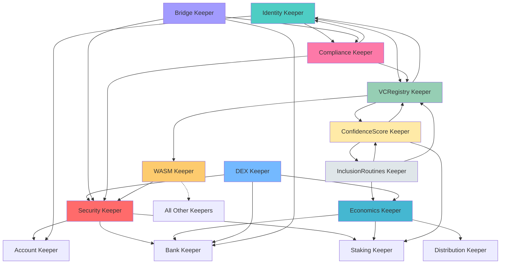

# AURA Blockchain - Consolidated Architecture Documentation

> **Version:** 1.0
> **Last Updated:** 2025-11-27
> **Status:** Development Phase - Active Consolidation

---

## Table of Contents

1. [Module Architecture Overview](#1-module-architecture-overview)
2. [Consolidated Modules](#2-consolidated-modules)
3. [Retained Modules](#3-retained-modules)
4. [Removed Modules](#4-removed-modules)
5. [Keeper Dependency Graph](#5-keeper-dependency-graph)
6. [Genesis State Structure](#6-genesis-state-structure)
7. [Migration Notes](#7-migration-notes)
8. [File Structure](#8-file-structure)
9. [Developer Guidelines](#9-developer-guidelines)

---

## 1. Module Architecture Overview

The AURA blockchain has undergone a significant architecture consolidation to improve maintainability, reduce complexity, and enhance developer experience.

### Key Metrics

- **Total Modules:** 11 (down from 24)
- **Consolidation Ratio:** 54% reduction
- **New Consolidated Modules:** 3 (security, identity, economics)
- **Store Keys:** Unified with logical prefixes

### Architecture Diagram

```
┌─────────────────────────────────────────────────────────────────┐
│                        AURA Blockchain                          │
├─────────────────────────────────────────────────────────────────┤
│                                                                 │
│  ┌──────────────┐  ┌──────────────┐  ┌──────────────┐         │
│  │   Security   │  │   Identity   │  │  Economics   │         │
│  │   (NEW)      │  │   (NEW)      │  │   (NEW)      │         │
│  └──────────────┘  └──────────────┘  └──────────────┘         │
│         │                 │                  │                  │
│         ├─────────────────┼──────────────────┤                  │
│         │                 │                  │                  │
│  ┌──────▼──────┐  ┌──────▼──────┐  ┌────────▼──────┐          │
│  │ vcregistry  │  │confidencescore│ │  inclusion   │          │
│  │  (expanded) │  │               │  │  routines    │          │
│  └─────────────┘  └───────────────┘  └──────────────┘          │
│         │                 │                  │                  │
│  ┌──────▼──────┐  ┌──────▼──────┐  ┌────────▼──────┐          │
│  │     DEX     │  │   Bridge    │  │  Compliance   │          │
│  └─────────────┘  └─────────────┘  └───────────────┘          │
│         │                 │                  │                  │
│  ┌──────▼─────────────────▼──────────────────▼──────┐          │
│  │              WASM (expanded)                      │          │
│  │  Absorbs: contractregistry, aura-bindings        │          │
│  └───────────────────────────────────────────────────┘          │
│                                                                 │
└─────────────────────────────────────────────────────────────────┘
```

### Module Relationships

```
Security Module
    ├─> Staking (for validator security)
    ├─> Bank (for wallet security, fund control)
    └─> Account (for access control)

Identity Module
    ├─> Account (for account management)
    ├─> VCRegistry (for credential verification)
    └─> Compliance (for audit trails)

Economics Module
    ├─> Bank (for treasury, fees)
    ├─> Staking (for governance voting power)
    └─> Distribution (for reward distribution)

VCRegistry
    ├─> Identity (for DID resolution)
    ├─> ConfidenceScore (for verifier trust)
    └─> WASM (for contract-based credentials)

ConfidenceScore
    ├─> InclusionRoutines (for IR completion tracking)
    ├─> VCRegistry (for verifier actions)
    └─> Staking (for validator performance)

InclusionRoutines
    ├─> ConfidenceScore (for score updates)
    ├─> VCRegistry (for data validation)
    └─> Economics (for fee management)

DEX
    ├─> Bank (for token transfers)
    ├─> Security (for rate limiting, security checks)
    └─> Economics (for dynamic fees)

Bridge
    ├─> Security (for cryptographic verification)
    ├─> Bank (for token minting/burning)
    └─> Compliance (for cross-chain compliance)

Compliance
    ├─> Identity (for KYC/identity verification)
    ├─> VCRegistry (for compliance credentials)
    └─> Security (for privacy-preserving checks)

WASM
    ├─> All modules (for smart contract integration)
    └─> Security (for sandboxing, rate limiting)
```

---

## 2. Consolidated Modules

### 2.1 Security Module (NEW)

**Store Key:** `security`

**Consolidates:**
- networksecurity
- validatorsecurity
- walletsecurity
- incidentresponse
- cryptography
- privacy

**Key Prefix Organization:**

```
Network Security:    0x01 - 0x09
├─ 0x01: NetworkParams
├─ 0x02: RateLimit
├─ 0x03: Reputation
├─ 0x04: TrustedPeer
├─ 0x05: Blacklist
├─ 0x06: GossipFilter
├─ 0x07: SybilDetection
├─ 0x08: ForkAlert
└─ 0x09: PartitionAlert

Validator Security:  0x10 - 0x17
├─ 0x10: ValidatorParams
├─ 0x11: ValidatorInfo
├─ 0x12: DoubleSignEvidence
├─ 0x13: DowntimeInfraction
├─ 0x14: ValidatorAlert
├─ 0x15: SentryNode
├─ 0x16: JailRecord
└─ 0x17: SlashRecord

Wallet Security:     0x20 - 0x2A
├─ 0x20: WalletParams
├─ 0x21: HardwareWallet
├─ 0x22: MultiSigWallet
├─ 0x23: PendingMultiSigTx
├─ 0x24: SocialRecovery
├─ 0x25: RecoveryRequest
├─ 0x26: DeviceFingerprint
├─ 0x27: Session
├─ 0x28: AnomalyDetection
├─ 0x29: WalletAnalytics
└─ 0x2A: InsurancePolicy

Incident Response:   0x30 - 0x35
├─ 0x30: IncidentParams
├─ 0x31: Incident
├─ 0x32: PauseState
├─ 0x33: WalletLimit
├─ 0x34: NextIncidentID
└─ 0x35: CircuitBreaker

Cryptography:        0x40 - 0x48
├─ 0x40: CryptoParams
├─ 0x41: KeyRotationSchedule
├─ 0x42: ThresholdScheme
├─ 0x43: ZKProofConfig
├─ 0x44: SecureEnclave
├─ 0x45: QuantumResistant
├─ 0x46: RandomSource
├─ 0x47: KeyStretching
└─ 0x48: CertificatePin

Privacy:             0x50 - 0x55
├─ 0x50: PrivacyParams
├─ 0x51: MixingPool
├─ 0x52: ViewKey
├─ 0x53: RingSignature
├─ 0x54: StealthAddress
└─ 0x55: ConfidentialTx
```

**Responsibilities:**

1. **Network Protection**
   - P2P network security (rate limiting, reputation, Sybil resistance)
   - Fork detection and partition monitoring
   - Peer blacklisting and gossip filtering

2. **Validator Security**
   - Double-signing detection and slashing
   - Downtime monitoring and penalties
   - Sentry node architecture support
   - Jailing and unjailing mechanisms

3. **Wallet Security**
   - Multi-signature wallet management
   - Hardware wallet integration
   - Social recovery mechanisms
   - Session management and device fingerprinting
   - Anomaly detection and wallet analytics
   - Wallet insurance policies

4. **Incident Response**
   - Emergency pause/unpause functionality
   - Circuit breakers for critical failures
   - Wallet spending limits during incidents
   - Incident tracking and resolution

5. **Cryptographic Operations**
   - Key rotation scheduling
   - Threshold cryptography
   - Zero-knowledge proof configuration
   - Quantum-resistant algorithms
   - Secure random number generation
   - Certificate pinning

6. **Privacy Features**
   - Mixing pools for transaction privacy
   - Ring signatures
   - Stealth addresses
   - Confidential transactions
   - View keys for selective disclosure

**Import Path:**
```go
import "github.com/aequitas/aura/chain/x/security"
```

---

### 2.2 Identity Module (NEW)

**Store Key:** `identity`

**Consolidates:**
- auth (AURA custom implementation)
- identitychange

**Key Prefix Organization:**

```
Auth/Role Management:  0x01 - 0x0e
├─ 0x00: Params
├─ 0x01: Role
├─ 0x02: RoleAssignment
├─ 0x03: PermissionGrant
├─ 0x04: AuditLog
├─ 0x05: Account
├─ 0x06: Session
├─ 0x07: UserSessions
├─ 0x08: RateLimitConfig
├─ 0x09: MultisigWallet
├─ 0x0a: MultisigProposal
├─ 0x0b: TimeLockedAction
├─ 0x0c: EmergencyAdmin
├─ 0x0d: EmergencyAction
└─ 0x0e: ValidatorRotation

Identity Change:       0x10 - 0x17
├─ 0x10: IdentityRecord
├─ 0x11: ChangeRequest
├─ 0x12: ChangeHistory
├─ 0x13: RecoveryRecord
├─ 0x14: Verification
├─ 0x15: Delegation
├─ 0x16: Federation
└─ 0x17: CrossChainLink

Counters:              0x20 - 0x21
├─ 0x20: AuditLogCounter
└─ 0x21: ChangeRequestCounter

Flags:                 0x30
└─ 0x30: Suspended
```

**Responsibilities:**

1. **Identity Management**
   - Decentralized Identifier (DID) creation and management
   - Identity record storage and retrieval
   - Cross-chain identity linking
   - Identity federation support

2. **Access Control**
   - Role-based access control (RBAC)
   - Permission management
   - Role assignments and revocations
   - Emergency admin mechanisms

3. **Identity Changes**
   - Change request workflow
   - Verifier-based approval system
   - Change history tracking
   - Recovery mechanisms for lost identities

4. **Session Management**
   - Session creation and validation
   - Multi-session support per user
   - Session expiration and cleanup

5. **Audit Trail**
   - Comprehensive audit logging
   - Immutable change history
   - Compliance-friendly record keeping

6. **Multi-signature Support**
   - Multi-sig wallet creation
   - Proposal management
   - Time-locked actions

**Import Path:**
```go
import "github.com/aequitas/aura/chain/x/identity"
```

---

### 2.3 Economics Module (NEW)

**Store Key:** `economics`

**Consolidates:**
- economicsecurity
- governance

**Key Prefix Organization:**

```
Fee Management:        0x01 - 0x04
├─ 0x01: DynamicFeeConfig
├─ 0x02: TransferTaxConfig
├─ 0x03: FeeMultiplier
└─ 0x04: UtilizationHistory

Vesting:               0x10 - 0x13
├─ 0x10: VestingSchedule
├─ 0x11: UserVestingIndex
├─ 0x12: VoteLock
└─ 0x13: UserVoteLockIndex

Treasury:              0x20 - 0x23
├─ 0x20: TreasuryMultisig
├─ 0x21: PendingTreasuryTx
├─ 0x22: TreasuryBalance
└─ 0x23: TreasuryTransactionCounter

Governance:            0x30 - 0x38
├─ 0x30: Proposal
├─ 0x31: Vote
├─ 0x32: Deposit
├─ 0x33: NextProposalID
├─ 0x34: VoteDelegation
├─ 0x35: SnapshotVote
├─ 0x36: VoteCommitment
├─ 0x37: VetoRequest
└─ 0x38: TokenLock

Economic Monitoring:   0x40 - 0x44
├─ 0x40: InflationAlert
├─ 0x41: LargeTxRecord
├─ 0x42: LastLargeTxTime
├─ 0x43: AddressHolding
└─ 0x44: PreviousInflation

MEV Protection:        0x50 - 0x52
├─ 0x50: UserMEVBalance
├─ 0x51: TotalMEVPending
└─ 0x52: TotalBurned

State Tracking:        0x60 - 0x62
├─ 0x60: CurrentHeight
├─ 0x61: CurrentTime
└─ 0x62: Params
```

**Responsibilities:**

1. **Fee Management**
   - Dynamic fee adjustment based on network utilization
   - Transfer tax configuration
   - Fee multipliers for different transaction types
   - Utilization history tracking

2. **Vesting**
   - Token vesting schedules
   - Time-based and milestone-based vesting
   - Vote locking for governance participation
   - Vesting schedule management per user

3. **Treasury Management**
   - Multi-signature treasury control
   - Pending transaction approval
   - Treasury balance tracking
   - Transaction history

4. **Governance**
   - Proposal creation and management
   - Voting mechanisms (standard, delegated, quadratic)
   - Deposit requirements
   - Vote commitment and privacy
   - Emergency veto system
   - Token locking for proposal security

5. **Economic Security**
   - Whale protection (large transaction monitoring)
   - MEV (Maximal Extractable Value) redistribution
   - Circuit breakers for economic attacks
   - Inflation monitoring and alerts

6. **Liquidity Mining**
   - Reward distribution for liquidity providers
   - Incentive alignment mechanisms

**Import Path:**
```go
import "github.com/aequitas/aura/chain/x/economics"
```

---

## 3. Retained Modules

### 3.1 VCRegistry (Expanded)

**Store Key:** `vcregistry`

**Expansion:** Absorbs data registry concepts

**Responsibilities:**
- Verifiable Credential issuance and management
- Credential verification and validation
- Credential revocation tracking
- Presentation proof generation and verification
- Schema management for credentials
- Data item registration (from dataregistry)
- IPFS integration for off-chain data
- Merkle tree verification

**Import Path:**
```go
import "github.com/aequitas/aura/chain/x/vcregistry"
```

---

### 3.2 ConfidenceScore

**Store Key:** `confidencescore`

**Responsibilities:**
- Verifier confidence score calculation
- Inclusion Routine (IR) completion tracking
- Score decay based on inactivity
- Reward distribution to verifiers
- Slashing for malicious behavior
- Score delegation mechanisms
- Score marketplace functionality
- Score verification and attestation

**Import Path:**
```go
import "github.com/aequitas/aura/chain/x/confidencescore"
```

---

### 3.3 InclusionRoutines

**Store Key:** `inclusionroutines`

**Responsibilities:**
- Inclusion Routine (IR) creation and management
- IR execution tracking
- Prerequisite validation
- Rate limiting per user/IR type
- Registry adapter for data access
- IR completion verification
- Comprehensive feature support (advanced IR types)

**Import Path:**
```go
import "github.com/aequitas/aura/chain/x/inclusionroutines"
```

---

### 3.4 DEX

**Store Key:** `dex`

**Responsibilities:**
- Decentralized exchange functionality
- Liquidity pool management
- Automated Market Maker (AMM)
- Order book management
- Token swaps
- HTLC (Hash Time-Locked Contracts) for atomic swaps
- Security features (slippage protection, rate limiting)
- DEX statistics and analytics
- Advanced trading features

**Import Path:**
```go
import "github.com/aequitas/aura/chain/x/dex"
```

---

### 3.5 Bridge

**Store Key:** `bridge`

**Responsibilities:**
- Cross-chain bridge operations
- Asset locking/unlocking
- Merkle proof verification
- Bridge security (rate limiting, circuit breakers)
- Multi-chain support
- Bridge relayer management
- Transaction finality tracking

**Import Path:**
```go
import "github.com/aequitas/aura/chain/x/bridge"
```

---

### 3.6 Compliance

**Store Key:** `compliance`

**Responsibilities:**
- Regulatory compliance tracking
- KYC/AML integration points
- GDPR compliance features
- Compliance record storage
- Privacy-preserving compliance checks
- Audit trail for compliance actions

**Import Path:**
```go
import "github.com/aequitas/aura/chain/x/compliance"
```

---

### 3.7 WASM (Expanded)

**Store Key:** `wasm`

**Expansion:** Absorbs contractregistry and aura-bindings

**Responsibilities:**
- Smart contract deployment and execution
- Contract registry (code storage, instantiation)
- AURA-specific bindings for contracts
- Contract security (sandboxing, gas metering)
- Contract upgrade mechanisms
- Query and message routing to contracts
- Integration with all AURA modules

**Import Path:**
```go
import "github.com/aequitas/aura/chain/x/wasm"
```

---

## 4. Removed Modules

### 4.1 Monitoring

**Status:** Removed (Off-chain utility)

**Rationale:**
- Monitoring is better handled by off-chain infrastructure
- Prometheus + Grafana provide superior monitoring capabilities
- Reduces blockchain state bloat
- Improves performance by removing non-consensus operations

**Migration Path:**
- Use Prometheus metrics exposed by the node
- Configure Grafana dashboards (see `/grafana/dashboards/`)
- Set up alerting rules (see `/prometheus/rules/`)

---

### 4.2 AIAssistant

**Status:** Removed (Off-chain utility)

**Rationale:**
- AI operations are computationally expensive for on-chain execution
- Better served by off-chain services with API integration
- Non-deterministic behavior unsuitable for consensus
- Reduces chain complexity

**Migration Path:**
- Deploy AI services separately
- Use Oracle pattern for AI results if needed on-chain
- Integrate via REST API or gRPC

---

### 4.3 Prevalidation

**Status:** Removed (Merged into ante handler)

**Rationale:**
- Validation logic belongs in the ante handler
- Reduces module count without losing functionality
- Improves transaction processing efficiency
- Maintains separation of concerns

**Migration Path:**
- Prevalidation logic moved to `chain/app/ante.go`
- No state migration required
- Validation still occurs, just in a more appropriate layer

---

## 5. Keeper Dependency Graph



### Keeper Initialization Order

The keepers must be initialized in dependency order to avoid nil pointer references:

1. **Bank Keeper** (no dependencies)
2. **Account Keeper** (no dependencies)
3. **Staking Keeper** (depends on Bank, Account)
4. **Distribution Keeper** (depends on Bank, Staking)
5. **Security Keeper** (depends on Bank, Staking, Account)
6. **Identity Keeper** (depends on Account)
7. **Economics Keeper** (depends on Bank, Staking, Distribution)
8. **Compliance Keeper** (depends on Identity, Security)
9. **VCRegistry Keeper** (depends on Identity, Compliance)
10. **ConfidenceScore Keeper** (depends on VCRegistry, Staking)
11. **InclusionRoutines Keeper** (depends on ConfidenceScore, VCRegistry, Economics)
12. **DEX Keeper** (depends on Bank, Security, Economics)
13. **Bridge Keeper** (depends on Security, Bank, Compliance)
14. **WASM Keeper** (depends on all above keepers)

---

## 6. Genesis State Structure

The consolidated genesis state structure:

```json
{
  "app_state": {
    "security": {
      "params": {
        "network": { /* network security params */ },
        "validator": { /* validator security params */ },
        "wallet": { /* wallet security params */ },
        "incident": { /* incident response params */ },
        "crypto": { /* cryptography params */ },
        "privacy": { /* privacy params */ }
      },
      "rate_limits": [],
      "reputations": [],
      "validators": [],
      "incidents": [],
      "key_rotation_schedules": [],
      "mixing_pools": []
    },
    "identity": {
      "params": { /* identity params */ },
      "roles": [
        {
          "name": "admin",
          "permissions": ["all"],
          "description": "System administrator"
        },
        {
          "name": "verifier",
          "permissions": ["verify_credentials", "issue_credentials"],
          "description": "Credential verifier"
        }
      ],
      "role_assignments": [],
      "audit_logs": [],
      "sessions": [],
      "identity_records": [],
      "change_requests": []
    },
    "economics": {
      "params": {
        "dynamic_fees": { /* fee config */ },
        "vesting": { /* vesting config */ },
        "governance": { /* governance config */ },
        "mev": { /* MEV protection config */ }
      },
      "vesting_schedules": [],
      "vote_locks": [],
      "treasury": {
        "multisig": null,
        "balance": "0",
        "pending_txs": []
      },
      "proposals": [],
      "votes": [],
      "deposits": []
    },
    "vcregistry": {
      "params": { /* VC params */ },
      "credentials": [],
      "schemas": [],
      "revocations": [],
      "data_items": []
    },
    "confidencescore": {
      "params": { /* score params */ },
      "scores": [],
      "rewards": [],
      "slashes": []
    },
    "inclusionroutines": {
      "params": { /* IR params */ },
      "routines": [],
      "completions": [],
      "rate_limits": []
    },
    "dex": {
      "params": { /* DEX params */ },
      "liquidity_pools": [],
      "orders": [],
      "swaps": []
    },
    "bridge": {
      "params": { /* bridge params */ },
      "locked_assets": [],
      "pending_transfers": []
    },
    "compliance": {
      "params": { /* compliance params */ },
      "records": []
    },
    "wasm": {
      "params": { /* WASM params */ },
      "codes": [],
      "contracts": []
    }
  }
}
```

---

## 7. Migration Notes

### 7.1 Development Phase (Current)

Since AURA is currently in the development phase, **no state migration is required**. The consolidation involves:

1. **Code reorganization** - Moving functionality into new module structures
2. **Import path updates** - Updating import statements throughout the codebase
3. **Store key changes** - New unified store keys with logical prefixes

### 7.2 Store Key Changes

| Old Module          | Old Store Key         | New Module   | New Store Key | Prefix Range |
|---------------------|-----------------------|--------------|---------------|--------------|
| networksecurity     | `networksecurity`     | security     | `security`    | 0x01-0x09    |
| validatorsecurity   | `validatorsecurity`   | security     | `security`    | 0x10-0x17    |
| walletsecurity      | `walletsecurity`      | security     | `security`    | 0x20-0x2A    |
| incidentresponse    | `incidentresponse`    | security     | `security`    | 0x30-0x35    |
| cryptography        | `cryptography`        | security     | `security`    | 0x40-0x48    |
| privacy             | `privacy`             | security     | `security`    | 0x50-0x55    |
| auth                | `auth`                | identity     | `identity`    | 0x01-0x0e    |
| identitychange      | `identitychange`      | identity     | `identity`    | 0x10-0x17    |
| economicsecurity    | `economicsecurity`    | economics    | `economics`   | 0x01-0x52    |
| governance          | `governance`          | economics    | `economics`   | 0x30-0x38    |

### 7.3 Import Path Changes

**Old:**
```go
import (
    "github.com/aequitas/aura/chain/x/networksecurity"
    nskeeper "github.com/aequitas/aura/chain/x/networksecurity/keeper"
    nstypes "github.com/aequitas/aura/chain/x/networksecurity/types"
)
```

**New:**
```go
import (
    "github.com/aequitas/aura/chain/x/security"
    securitykeeper "github.com/aequitas/aura/chain/x/security/keeper"
    securitytypes "github.com/aequitas/aura/chain/x/security/types"
)
```

### 7.4 Future Production Migration (When Needed)

If a production chain needs migration:

1. **State Export:** Export full state with `aurad export`
2. **State Transform:** Run migration script to reorganize state
3. **Genesis Update:** Update genesis with new module structure
4. **Chain Restart:** Initialize new chain with transformed state

**Migration Script Pseudocode:**
```go
// For security module
newSecurityState := SecurityGenesisState{
    NetworkState:    oldNetworkSecurityState,
    ValidatorState:  oldValidatorSecurityState,
    WalletState:     oldWalletSecurityState,
    IncidentState:   oldIncidentResponseState,
    CryptoState:     oldCryptographyState,
    PrivacyState:    oldPrivacyState,
}

// Similar for identity and economics modules
```

---

## 8. File Structure

### 8.1 Module Directory Layout

```
chain/x/
├── security/                    # Consolidated security module
│   ├── keeper/
│   │   ├── keeper.go           # Main keeper
│   │   ├── network.go          # Network security functions
│   │   ├── validator.go        # Validator security functions
│   │   ├── wallet.go           # Wallet security functions
│   │   ├── incident.go         # Incident response functions
│   │   ├── crypto.go           # Cryptography functions
│   │   ├── privacy.go          # Privacy functions
│   │   └── genesis.go          # Genesis initialization
│   ├── types/
│   │   ├── keys.go             # Store keys and prefixes
│   │   ├── genesis.go          # Genesis types
│   │   ├── params.go           # Parameter types
│   │   ├── network.go          # Network types
│   │   ├── validator.go        # Validator types
│   │   ├── wallet.go           # Wallet types
│   │   ├── incident.go         # Incident types
│   │   ├── crypto.go           # Crypto types
│   │   └── privacy.go          # Privacy types
│   ├── client/cli/              # CLI commands
│   └── module.go               # Module definition
│
├── identity/                    # Consolidated identity module
│   ├── keeper/
│   │   ├── keeper.go           # Main keeper
│   │   ├── roles.go            # Role management
│   │   ├── auth.go             # Authentication
│   │   ├── identity_change.go  # Identity change workflow
│   │   ├── audit.go            # Audit logging
│   │   └── genesis.go          # Genesis initialization
│   ├── types/
│   │   ├── keys.go             # Store keys and prefixes
│   │   ├── genesis.go          # Genesis types
│   │   ├── roles.go            # Role types
│   │   ├── identity.go         # Identity types
│   │   └── change.go           # Change request types
│   ├── client/cli/              # CLI commands
│   └── module.go               # Module definition
│
├── economics/                   # Consolidated economics module
│   ├── keeper/
│   │   ├── keeper.go           # Main keeper
│   │   ├── fees.go             # Dynamic fees
│   │   ├── vesting.go          # Vesting schedules
│   │   ├── treasury.go         # Treasury management
│   │   ├── governance.go       # Governance functions
│   │   ├── mev.go              # MEV protection
│   │   └── genesis.go          # Genesis initialization
│   ├── types/
│   │   ├── keys.go             # Store keys and prefixes
│   │   ├── genesis.go          # Genesis types
│   │   ├── fees.go             # Fee types
│   │   ├── vesting.go          # Vesting types
│   │   ├── governance.go       # Governance types
│   │   └── mev.go              # MEV types
│   ├── client/cli/              # CLI commands
│   └── module.go               # Module definition
│
├── vcregistry/                  # VC registry (expanded)
│   ├── keeper/
│   ├── types/
│   ├── client/cli/
│   ├── ipfs/                   # IPFS integration
│   └── module.go
│
├── confidencescore/             # Confidence score module
│   ├── keeper/
│   ├── types/
│   ├── params/
│   └── module.go
│
├── inclusionroutines/           # Inclusion routines module
│   ├── keeper/
│   ├── types/
│   ├── params/
│   └── module.go
│
├── dex/                         # DEX module
│   ├── keeper/
│   ├── types/
│   ├── client/cli/
│   └── module.go
│
├── bridge/                      # Bridge module
│   ├── keeper/
│   ├── types/
│   ├── client/cli/
│   └── module.go
│
├── compliance/                  # Compliance module
│   ├── keeper/
│   ├── types/
│   ├── client/cli/
│   └── module.go
│
├── wasm/                        # WASM module (expanded)
│   ├── keeper/
│   │   ├── keeper.go
│   │   ├── contract.go
│   │   ├── registry.go         # From contractregistry
│   │   └── bindings.go         # From aura-bindings
│   ├── types/
│   ├── client/cli/
│   └── module.go
│
└── common/                      # Shared utilities
    ├── security/                # Security utilities
    ├── validation/              # Validation helpers
    ├── cache/                   # Caching utilities
    ├── gasmetering/             # Gas metering
    ├── optimization/            # Performance optimizations
    └── determinism/             # Determinism helpers
```

### 8.2 Application Integration

**File:** `chain/app/app.go`

```go
// Module store keys
keys := storetypes.NewKVStoreKeys(
    // Standard Cosmos modules
    authtypes.StoreKey,
    banktypes.StoreKey,
    stakingtypes.StoreKey,
    distrtypes.StoreKey,
    slashingtypes.StoreKey,

    // AURA consolidated modules
    securitytypes.StoreKey,      // "security"
    identitytypes.StoreKey,       // "identity"
    economicstypes.StoreKey,      // "economics"

    // AURA specific modules
    vctypes.StoreKey,             // "vcregistry"
    cstypes.StoreKey,             // "confidencescore"
    irtypes.StoreKey,             // "inclusionroutines"
    dextypes.StoreKey,            // "dex"
    bridgetypes.StoreKey,         // "bridge"
    compliancetypes.StoreKey,     // "compliance"
    wasmtypes.StoreKey,           // "wasm"
)
```

---

## 9. Developer Guidelines

### 9.1 Adding New Features

When adding features to consolidated modules:

1. **Identify the appropriate domain** (network, validator, wallet, etc.)
2. **Use the correct key prefix** for the domain
3. **Add keeper functions** in the domain-specific file (e.g., `network.go`)
4. **Add types** in the domain-specific types file
5. **Update genesis** to include new state
6. **Add tests** for new functionality

### 9.2 Keeper Method Naming Conventions

```go
// Security module - domain-prefixed methods
func (k Keeper) SetNetworkRateLimit(ctx sdk.Context, limit RateLimit)
func (k Keeper) GetValidatorInfo(ctx sdk.Context, addr sdk.ValAddress)
func (k Keeper) CreateWalletSession(ctx sdk.Context, session Session)
func (k Keeper) ReportIncident(ctx sdk.Context, incident Incident)
func (k Keeper) RotateCryptoKey(ctx sdk.Context, keyID string)
func (k Keeper) AddToMixingPool(ctx sdk.Context, tx ConfidentialTx)

// Identity module
func (k Keeper) AssignRole(ctx sdk.Context, address, role string)
func (k Keeper) CreateChangeRequest(ctx sdk.Context, req ChangeRequest)
func (k Keeper) VerifyIdentity(ctx sdk.Context, did string)

// Economics module
func (k Keeper) UpdateDynamicFee(ctx sdk.Context, fee FeeConfig)
func (k Keeper) CreateProposal(ctx sdk.Context, proposal Proposal)
func (k Keeper) AddVestingSchedule(ctx sdk.Context, schedule VestingSchedule)
```

### 9.3 Testing Guidelines

Test files should mirror the keeper structure:

```
keeper/
├── keeper_test.go              # Basic keeper tests
├── network_test.go             # Network security tests
├── validator_test.go           # Validator security tests
├── wallet_test.go              # Wallet security tests
├── incident_test.go            # Incident response tests
├── crypto_test.go              # Cryptography tests
├── privacy_test.go             # Privacy tests
└── genesis_test.go             # Genesis tests
```

### 9.4 Documentation Requirements

Each consolidated module must maintain:

1. **README.md** - Module overview and architecture
2. **SPEC.md** - Detailed specification
3. **API.md** - gRPC/REST API documentation
4. **CLI.md** - Command-line interface guide
5. **Integration guides** - How to integrate with other modules

### 9.5 Proto Definitions

Proto files should be organized by domain:

```
proto/aura/security/v1beta1/
├── security.proto              # Main types
├── network.proto               # Network types
├── validator.proto             # Validator types
├── wallet.proto                # Wallet types
├── incident.proto              # Incident types
├── crypto.proto                # Crypto types
├── privacy.proto               # Privacy types
├── query.proto                 # Query service
└── tx.proto                    # Tx service
```

### 9.6 Best Practices

1. **Maintain logical separation** - Even within a consolidated module, maintain clear separation between domains
2. **Use consistent prefixes** - Always use the defined key prefixes for the domain
3. **Document cross-domain interactions** - When one domain interacts with another, document the relationship
4. **Preserve backward compatibility** - When possible, maintain compatibility with old module interfaces
5. **Write comprehensive tests** - Aim for >80% code coverage
6. **Use deterministic operations** - All state changes must be deterministic for consensus
7. **Optimize for performance** - Use caching and efficient data structures
8. **Follow Cosmos SDK conventions** - Maintain consistency with standard Cosmos modules

---

## Appendix A: Quick Reference

### Module Count
- **Before:** 24 modules
- **After:** 11 modules
- **Reduction:** 54%

### Store Keys
- security
- identity
- economics
- vcregistry
- confidencescore
- inclusionroutines
- dex
- bridge
- compliance
- wasm

### Import Paths
```go
"github.com/aequitas/aura/chain/x/security"
"github.com/aequitas/aura/chain/x/identity"
"github.com/aequitas/aura/chain/x/economics"
"github.com/aequitas/aura/chain/x/vcregistry"
"github.com/aequitas/aura/chain/x/confidencescore"
"github.com/aequitas/aura/chain/x/inclusionroutines"
"github.com/aequitas/aura/chain/x/dex"
"github.com/aequitas/aura/chain/x/bridge"
"github.com/aequitas/aura/chain/x/compliance"
"github.com/aequitas/aura/chain/x/wasm"
```

---

## Appendix B: Consolidation Rationale

### Why Consolidate?

1. **Reduced Complexity**
   - Fewer modules to understand and maintain
   - Clearer separation of concerns
   - Easier onboarding for new developers

2. **Improved Performance**
   - Fewer module boundaries to cross
   - Reduced overhead from module initialization
   - Better cache locality

3. **Better Developer Experience**
   - Logical grouping of related functionality
   - Easier to find relevant code
   - Consistent patterns across domains

4. **Maintainability**
   - Fewer breaking changes across module boundaries
   - Easier to refactor within a domain
   - Clear ownership of functionality

5. **Governance Simplification**
   - Fewer parameter sets to manage
   - Clearer upgrade paths
   - Simplified proposal structure

---

## Appendix C: Version History

| Version | Date       | Changes                                    |
|---------|------------|--------------------------------------------|
| 1.0     | 2025-11-27 | Initial consolidated architecture document |

---

**Document Maintainers:**
- Architecture Team
- Core Development Team

**Questions or Feedback:**
- Open an issue in the GitHub repository
- Contact the architecture team
- Join the developer Discord channel
