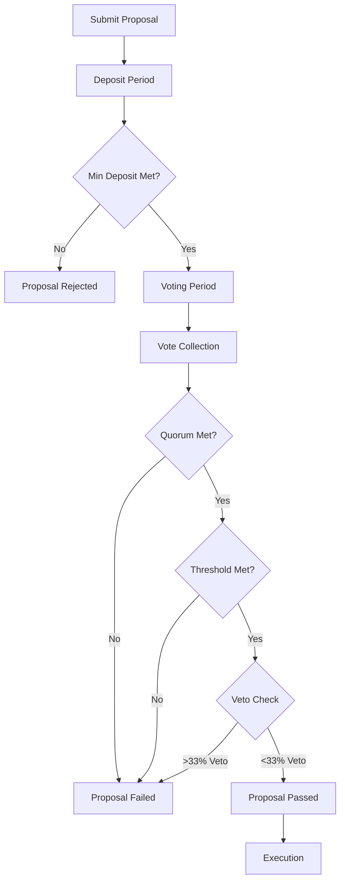

# Compliance & Governance Framework

## Overview

The AURA blockchain implements comprehensive compliance and governance mechanisms to meet regulatory requirements while maintaining decentralization.

## Regulatory Compliance

### KYC/AML Integration

The compliance module provides hooks for Know Your Customer (KYC) and Anti-Money Laundering (AML) verification:

```go
// Submit KYC verification
aurad tx compliance submit-kyc <verification-hash> --from <user>

// Query compliance status
aurad query compliance status <address>
```

### Features

- **Identity Verification**: Integration with third-party KYC providers
- **Risk Scoring**: Automated risk assessment for transactions
- **Transaction Monitoring**: Real-time monitoring for suspicious patterns
- **Sanctions Screening**: Automatic checking against sanctions lists
- **Audit Trails**: Complete audit logs for regulatory reporting

### Compliance Levels

1. **Level 0**: No verification required (public queries only)
2. **Level 1**: Basic identity verification (standard transactions)
3. **Level 2**: Enhanced due diligence (high-value transactions)
4. **Level 3**: Institutional verification (validator operations)

## Governance Mechanisms

### On-Chain Governance

AURA uses a decentralized governance system where token holders can:

1. **Submit Proposals**: Any token holder can submit governance proposals
2. **Vote on Proposals**: Weighted voting based on stake
3. **Execute Changes**: Automatic execution upon approval

### Proposal Types

#### 1. Text Proposals

General governance decisions requiring community input:

```bash
aurad tx gov submit-proposal \
  --title "Network Upgrade Strategy" \
  --description "Proposal to adopt new consensus mechanism" \
  --type Text \
  --deposit 1000000uaura \
  --from proposer
```

#### 2. Parameter Change Proposals

Modify module parameters without chain upgrade:

```bash
aurad tx gov submit-proposal param-change \
  --from proposer \
  --deposit 1000000uaura \
  proposal.json
```

Example `proposal.json`:
```json
{
  "title": "Increase Bridge Fee",
  "description": "Increase bridge fee from 0.1% to 0.2%",
  "changes": [
    {
      "subspace": "bridge",
      "key": "BridgeFeeBasisPoints",
      "value": "20"
    }
  ],
  "deposit": "1000000uaura"
}
```

#### 3. Software Upgrade Proposals

Coordinate chain upgrades:

```bash
aurad tx gov submit-proposal software-upgrade v2.0.0 \
  --title "AURA v2.0.0 Upgrade" \
  --description "Major protocol upgrade" \
  --upgrade-height 1000000 \
  --deposit 1000000uaura \
  --from proposer
```

#### 4. Community Pool Spend Proposals

Allocate funds from community pool:

```bash
aurad tx gov submit-proposal community-pool-spend \
  --title "Grant for Development" \
  --description "Fund core development team" \
  --recipient aura1... \
  --amount 100000uaura \
  --deposit 1000000uaura \
  --from proposer
```

### Voting Process

#### Voting Options

- **Yes**: Approve the proposal
- **No**: Reject the proposal
- **NoWithVeto**: Reject and penalize proposer
- **Abstain**: Acknowledge but don't influence outcome

#### Voting Mechanics

```bash
# Cast vote
aurad tx gov vote <proposal-id> yes --from voter

# Weighted vote
aurad tx gov weighted-vote <proposal-id> \
  yes=0.6,no=0.3,abstain=0.1 \
  --from voter

# Query proposal
aurad query gov proposal <proposal-id>

# Query votes
aurad query gov votes <proposal-id>

# Query tally
aurad query gov tally <proposal-id>
```

#### Governance Parameters

- **Minimum Deposit**: 1,000,000 AURA
- **Voting Period**: 14 days
- **Quorum**: 33.4% of total staked tokens must vote
- **Threshold**: 50% of votes must be Yes
- **Veto Threshold**: 33.4% NoWithVeto fails proposal

## Emergency Procedures

### Circuit Breakers

Automatic halt mechanisms for critical situations:

1. **Transaction Volume**: Pause if unusual spike detected
2. **Bridge Activity**: Halt cross-chain transfers if suspicious
3. **Validator Set**: Freeze if >33% offline
4. **Oracle Deviation**: Stop if price feeds diverge significantly

### Emergency Admin Powers

Time-limited emergency powers for critical response:

```go
// Grant emergency admin (requires governance)
aurad tx auth grant-emergency-admin <address> \
  --duration 24h \
  --privileges pause,halt \
  --from governance

// Emergency pause module
aurad tx auth emergency-pause bridge --from emergency-admin

// Resume operations
aurad tx auth emergency-resume bridge --from emergency-admin
```

### Incident Response Plan

1. **Detection**: Automated monitoring alerts
2. **Assessment**: Security team evaluates severity
3. **Action**: Execute appropriate emergency procedure
4. **Communication**: Notify community and stakeholders
5. **Resolution**: Implement fix and resume operations
6. **Post-Mortem**: Document incident and preventive measures

## Governance Workflows

### Standard Proposal Flow



### Fast-Track Proposals

For urgent matters, validators can fast-track proposals:

1. Requires 67% validator approval
2. Reduced voting period (3 days)
3. Higher deposit requirement (10x standard)

```bash
aurad tx gov submit-proposal --fast-track \
  --title "Emergency Security Fix" \
  --deposit 10000000uaura \
  --from proposer
```

## Delegation & Liquid Staking

### Validator Delegation

Token holders can delegate to validators:

```bash
# Delegate tokens
aurad tx staking delegate <validator-addr> 1000000uaura --from delegator

# Redelegate to different validator
aurad tx staking redelegate <src-validator> <dst-validator> \
  1000000uaura --from delegator

# Undelegate tokens (21-day unbonding)
aurad tx staking unbond <validator-addr> 1000000uaura --from delegator
```

### Voting Power

Delegators inherit voting power but can override validator votes:

```bash
# Delegator votes (overrides validator vote)
aurad tx gov vote <proposal-id> no --from delegator
```

## Proposal Templates

### Parameter Change Template

```json
{
  "title": "Adjust Module Parameter",
  "description": "Detailed rationale for parameter change...",
  "changes": [
    {
      "subspace": "module-name",
      "key": "ParameterKey",
      "value": "new-value"
    }
  ],
  "deposit": "1000000uaura",
  "metadata": {
    "proposed_by": "Community Member",
    "discussion_url": "https://forum.aura.network/proposal/123",
    "impact_analysis": "Expected to reduce fees by 10%"
  }
}
```

### Upgrade Proposal Template

```json
{
  "title": "AURA Network Upgrade v2.1.0",
  "description": "## Summary\n\nMajor upgrade including:\n- Performance improvements\n- New module: X\n- Bug fixes\n\n## Technical Details\n\n- Upgrade Height: 1234567\n- Binary: aurad v2.1.0\n- Breaking Changes: None\n\n## Testing\n\n- Testnet deployed: aura-testnet-2\n- Audit: Completed by XYZ Security\n\n## Rollback Plan\n\nSnapshot at height 1234566, can rollback if needed.",
  "upgrade_height": 1234567,
  "upgrade_info": {
    "name": "v2.1.0",
    "height": 1234567,
    "info": "https://github.com/aequitas/aura/releases/v2.1.0"
  }
}
```

## Compliance Reporting

### Automated Reports

The chain generates compliance reports automatically:

```bash
# Generate compliance report
aurad query compliance report \
  --start-date 2024-01-01 \
  --end-date 2024-01-31 \
  --format pdf \
  --output report.pdf
```

### Report Contents

1. **Transaction Summary**: Volume, count, participants
2. **Risk Events**: Flagged transactions and resolutions
3. **KYC Statistics**: Verification rates, levels
4. **Governance Activity**: Proposals, votes, outcomes
5. **Validator Performance**: Uptime, missed blocks, slashing events

## Best Practices

### For Proposal Submitters

1. **Pre-Discussion**: Socialize idea on forum first
2. **Clear Rationale**: Explain why change is needed
3. **Impact Analysis**: Document expected effects
4. **Testing**: Test on testnet if applicable
5. **Community Support**: Gauge sentiment before submitting

### For Validators

1. **Review Thoroughly**: Understand technical implications
2. **Vote Responsibly**: Consider long-term network health
3. **Communicate**: Explain voting decisions to delegators
4. **Stay Informed**: Monitor governance forum
5. **Security First**: Prioritize network security

### For Delegators

1. **Choose Wisely**: Select validators aligned with your values
2. **Monitor Activity**: Track validator voting behavior
3. **Participate**: Override validator vote when needed
4. **Diversify**: Don't delegate all tokens to one validator
5. **Stay Engaged**: Follow governance discussions

## Compliance Checklist

### For Validators

- [ ] KYC verification completed (Level 3)
- [ ] Jurisdiction disclosure filed
- [ ] Terms of service accepted
- [ ] Slashing insurance recommended
- [ ] Emergency contacts provided
- [ ] Incident response plan documented

### For Users

- [ ] Account verified (appropriate level)
- [ ] Risk assessment completed
- [ ] Transaction limits understood
- [ ] Prohibited activities reviewed
- [ ] Privacy policy acknowledged

### For Developers

- [ ] Security audit completed
- [ ] Compliance review passed
- [ ] Privacy impact assessment
- [ ] Data retention policy defined
- [ ] Incident response procedure

## Resources

- **Governance Forum**: https://forum.aura.network
- **Proposal Tracker**: https://governance.aura.network
- **Compliance Portal**: https://compliance.aura.network
- **Documentation**: https://docs.aura.network/governance
- **Support**: governance@aura.network

## Appendix: Regulatory Framework

### Supported Jurisdictions

AURA maintains compliance frameworks for:

- United States (FinCEN, SEC)
- European Union (MiCA, GDPR)
- United Kingdom (FCA)
- Switzerland (FINMA)
- Singapore (MAS)
- Others as adopted

### Compliance Standards

- **ISO 27001**: Information security
- **SOC 2 Type II**: Service organization controls
- **GDPR**: Data protection and privacy
- **AML/CTF**: Anti-money laundering
- **FATF**: Financial action task force guidelines
